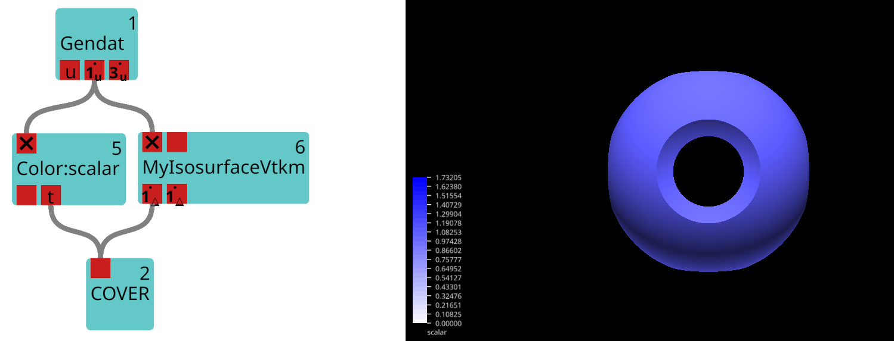
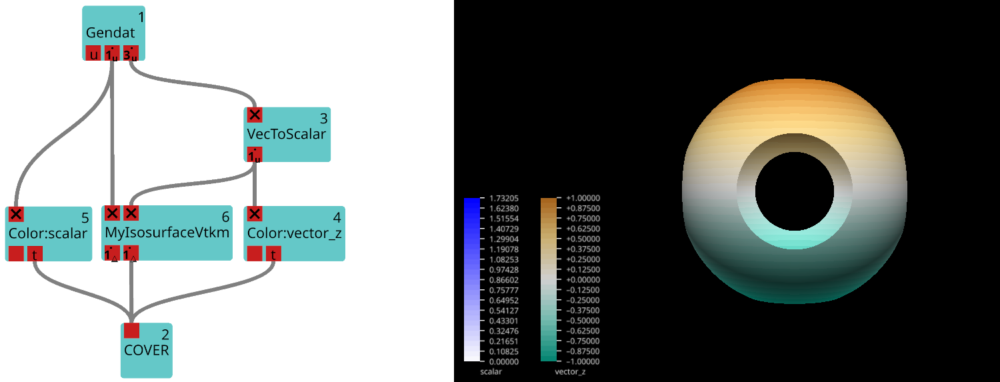
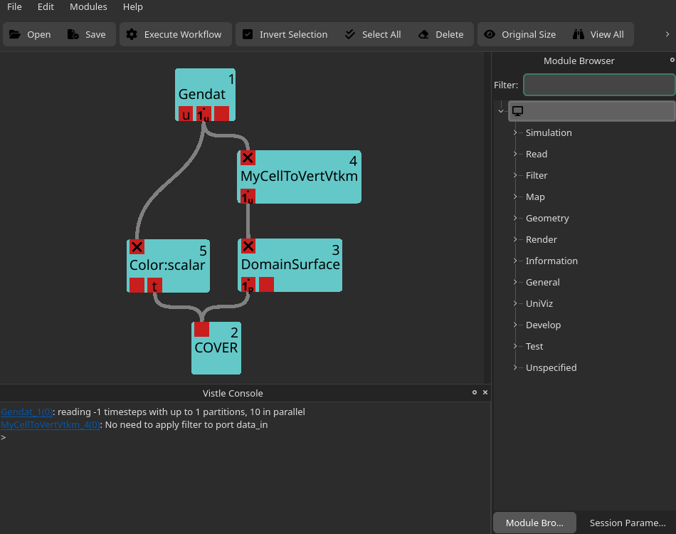

# How to Write a GPU Module

This guide explains how to write Vistle modules that can be run on the GPU. It assumes you are familiar with the [basics on how to write a Vistle module](implementation-basics.md).   

Vistle makes use of the portable toolkit [VTK-m](https://m.vtk.org/) which allows running scientific visualization algorithms on various devices, including GPUs, and is designed to keep data transfers between devices at a minimum.

## Overview
- [The VtkmModule Class](#the-vtkmmodule-class)
- [Example 1: Basic Usage](#example-1-basic-usage)
- [Example 2: Extending the Core Functionality](#example-2-extending-the-core-functionality)
- [Custom VTK-m Filters](#custom-vtk-m-filters)
- [How to Configure Vistle to Run VTK-m Modules on the GPU](#how-to-configure-vistle-to-run-vtk-m-modules-on-the-gpu)


## The VtkmModule Class

The class `VtkmModule` is the base class for VTK-m modules in Vistle. It is designed to make adding new VTK-m algorithms, so-called [filters](https://vtk-m.readthedocs.io/en/v2.2.0/provided-filters.html), as simple as possible by providing core functionality for handling the input data, passing it to the filter implemented by the derived class, and writing the filter result to the output ports. At the same time, it is meant to be flexible, allowing the derived class to customize and extend these processes, if desired.

In order to implement a module wrapping a filter provided by or relying on VTK-m, one implements a class deriving from `VtkmModule`.

**Note:** The class `VtkmModule` derives from `Module`, i.e.,  many of its features, like the functionality for adding module parameters, can be used by VTK-m modules, too.

### The Constructor

The `VtkmModule` constructor, which the derived class should call in its own constructor, creates the input and output ports of the VTK-m module.

```cpp
VtkmModule(const std::string &name, int moduleID, mpi::communicator comm, int numPorts = 1, bool requireMappedData = true);
```

By default, a VTK-m module provides of one input port and one output port, but additional ports can be added by specifying the desired number in the base constructor (`numPorts`). Note that all data on the input ports must be defined on the same grid, as the module will throw an error, otherwise.

Many VTK-m filters work on data fields, so, by default, a VTK-m module expects the data at the input ports to contain mapped data in addition to a grid and will throw an error if there is none. If desired, the derived class can remove this requirement by setting `requireMappedData` to `false`.

### Defining the VTK-m Filter

The `setUpFilter` method, which must be implemented by the derived class, creates, sets up and returns the desired VTK-m filter that will be called on the input data.  

```cpp
virtual std::unique_ptr<vtkm::filter::Filter> setUpFilter() const = 0;
```
  
If the VTK-m module has multiple input ports, the filter will only be applied to the data on the first input port, i.e., the filter's active field is set to the field on the first port. The fields on the remaining ports will be mapped to the resulting output grid.

### Preparing the Input Data

The `prepareInputGrid` transforms the input grid into a VTK-m cellset and adds it to the VTK-m dataset `dataset`. Similarly, `prepareOutputGrid`, which is called once per field, transforms the input fields into VTK-m array handles and adds them to `dataset` as well. The filter will, subsequently, be applied to `dataset`.
```cpp
virtual ModuleStatusPtr prepareInputGrid(const vistle::Object::const_ptr &grid, vtkm::cont::DataSet &dataset) const;
virtual ModuleStatusPtr prepareInputField(const vistle::Port *port, const vistle::Object::const_ptr &grid, const vistle::DataBase::const_ptr &field, std::string &fieldName, vtkm::cont::DataSet &dataset) const;
```

A VTK-m module only performs very basic checks on the input ports while reading in the data, i.e., in the `readInPorts` method: It ensures each input port contains data as long as its corresponding output port is connected. Additionally, it makes sure that at least one input grid provides an input grid and that all data fields are defined on the same grid.
Some filters might, however, require additional checks on the input data. These can be added by overriding `prepareInputGrid` and/or `prepareInputField` as needed.

### Preparing the Output Data

`prepareOutputGrid` and `prepareOutputField`, which is called once per field, transform the filter results that will be added to the output ports back into the Vistle format. The output data field, which contains the output grid, is added to the ports. If `requireMappedData` is `false`, only the output grid is added.

```cpp
virtual vistle::Object::ptr prepareOutputGrid(const vtkm::cont::DataSet &dataset, const vistle::Object::const_ptr &inputGrid) const;
virtual vistle::DataBase::ptr prepareOutputField(const vtkm::cont::DataSet &dataset, const vistle::Object::const_ptr &inputGrid, const vistle::DataBase::const_ptr &inputField, const std::string &fieldName, const vistle::Object::ptr &outputGrid) const;
```

By default, the VTK-m module simply copies the attributes from the input grid and fields to the output grid and fields, respectively. It also sets the output field's grid to the output grid. To account for possible attribute changes after applying the filter, e.g., when the filter changes the field's mapping from element- to cell-based, the derived class can override these two methods as needed.

## Example 1: Basic usage

This first example illustrates how to use the base functionalities of the `VtkmModule` class. It will create a VTK-m module **MyIsosurfaceVtkm** which calls [VTK-m's Contour filter](https://vtk-m.readthedocs.io/en/v2.2.0/provided-filters.html#contour) to generate an isosurface.


### The Header
Let's first inspect the new module's header file:

```cpp
#ifndef VISTLE_MYISOSURFACEVTKM_MYISOSURFACEVTKM_H
#define VISTLE_MYISOSURFACEVTKM_MYISOSURFACEVTKM_H

#include <vistle/vtkm/vtkm_module.h>

class MyIsosurfaceVtkm: public VtkmModule {
public:
    MyIsosurfaceVtkm(const std::string &name, int moduleID, mpi::communicator comm);
    ~MyIsosurfaceVtkm();

private:
    vistle::FloatParameter *m_isovalue;

    std::unique_ptr<vtkm::filter::Filter> setUpFilter() const override;
};

#endif
```

As the goal is to use VTK-m to run the algorithm on the GPU, the module inherits from the `VtkmModule` class which is defined in `vistle/vtkm/vtkm_module.h`:

```cpp
class MyIsosurfaceVtkm: public VtkmModule {
```

Because of inheriting from said class, `MyIsosurfaceVtkm` must override the `setUpFilter()` method to prepare the desired filter to be applied to the input dataset:
```cpp
std::unique_ptr<vtkm::filter::Filter> setUpFilter() const override;
```

The Contour filter needs an isovalue. Since `VtkmModule` inherits from the `Module` class, we can simply define a float parameter for this purpose:
```cpp
vistle::FloatParameter *m_isovalue;
```

### The Source File

Next, the corresponding source file will be discussed:
```cpp
#include <vtkm/filter/contour/Contour.h>
#include "MyIsosurfaceVtkm.h"

MODULE_MAIN(MyIsosurfaceVtkm)

using namespace vistle;

MyIsosurfaceVtkm::MyIsosurfaceVtkm(const std::string &name, int moduleID, mpi::communicator comm)
: VtkmModule(name, moduleID, comm, 2)
{
    m_isovalue = addFloatParameter("isovalue", "isovalue", 0.0);
}

MyIsosurfaceVtkm::~MyIsosurfaceVtkm()
{}

std::unique_ptr<vtkm::filter::Filter> MyIsosurfaceVtkm::setUpFilter() const
{
    auto filter = std::make_unique<vtkm::filter::contour::Contour>();
    filter->SetIsoValue(m_isovalue->getValue());

    return filter;
}

```

Like any Vistle module, VTK-m modules must also call the `MODULE_MAIN` function to make sure it is integrated correctly into the software:
```cpp
MODULE_MAIN(MyIsosurfaceVtkm)
```

The constructor must call the base constructor:
```cpp
MyIsosurfaceVtkm::MyIsosurfaceVtkm(const std::string &name, int moduleID, mpi::communicator comm)
: VtkmModule(name, moduleID, comm, 2)
{
    m_isovalue = addFloatParameter("isovalue", "isovalue", 0.0);
}
```
The base constructor lets us choose the number of ports. Here, the number of ports is 2. This means that the Contour filter will use the data field on the first input port to create the isosurface. The data on the second port will then simply be mapped to the resulting geometry.   
The constructor can, e.g., be used to define module parameters like the isovalue.

Finally, we create a Contour filter in the `setUpFilter` method, pass the isovalue to it and return it:

```cpp
std::unique_ptr<vtkm::filter::Filter> MyIsosurfaceVtkm::setUpFilter() const
{
    auto filter = std::make_unique<vtkm::filter::contour::Contour>();
    filter->SetIsoValue(m_isovalue->getValue());

    return filter;
}
```

### Adding the Module to Vistle

Adding a VTK-m module to Vistle is very similar to adding a regular module to Vistle. In the module's `CMakeLists.txt`, we call the `add_vtkm_module` target which makes sure the correct VTK-m libraries are linked in addition to all necessary Vistle libraries:
```cmake
add_vtkm_module(MyIsosurfaceVtkm "Basic GPU module using VTK-m's Contour filter" MyIsosurfaceVtkm.h MyIsosurfaceVtkm.cpp)
```

Then, we must choose the module category which fits best, and add the new subdirectory to the corresponding `CMakeLists.txt` file:
```cmake
add_subdirectory(MyIsosurfaceVtkm)
```

### The Result

The code above produces a Vistle module **MyIsosurfaceVtkm** which consists of two input and output ports as well as a float parameter to set the isovalue and which calculates the isosurface using VTK-m's Contour filter.

The data field on the first input port is used to calculate the isosurface. In the following example workflow, **MyIsosurfaceVtkm** reads in the data field named *scalar* and uses it to create an isosurface of isovalue 1.1:



Since **scalar** is the data field on the first input port and was thus used as the filter's active field, the data field on the first output port is uniform on the resulting output geometry.

For comparison, a second input field called `vector_z` is connected to **IsosurfaceVtkm** in the following example workflow:


The resulting geometry remains the same because the data on the first input port and the isovalue have not changed. The second output port returns the data field `vector_z` mapped to the output grid, which leads to a different coloring of the geometry.

## Example 2: Extending the Core Functionality

In this second example, the derived class will change the methods for handling its input and output data. The new class **MyCertToVellVtkm** will call the [Point Average filter](https://vtk-m.readthedocs.io/en/v2.2.0/provided-filters.html#point-average) to transform a cell-based data field into an equivalent vertex-based field. It, however, only applies the filter if the input data is cell-based. If not, it simply adds the input field to the output port.

### The Header File

To implement the desired behaviour, `MyCellToVertVtkm` overrides the `prepareInputField`, `prepareOutputGrid` and `prepareOutputField` methods:

```cpp
#ifndef VISTLE_MYCELLTOVERTVTKM_MYCELLTOVERTVTKM_H
#define VISTLE_MYCELLTOVERTVTKM_MYCELLTOVERTVTKM_H

#include <array>
#include <vistle/vtkm/vtkm_module.h>

class MyCellToVertVtkm: public VtkmModule {
public:
    MyCellToVertVtkm(const std::string &name, int moduleID, mpi::communicator comm);
    ~MyCellToVertVtkm();

private:
    ModuleStatusPtr prepareInputField(const vistle::Port *port, const vistle::Object::const_ptr &grid, const vistle::DataBase::const_ptr &field, std::string &fieldName,vtkm::cont::DataSet &dataset) const override;

    std::unique_ptr<vtkm::filter::Filter> setUpFilter() const override;

    vistle::Object::ptr prepareOutputGrid(const vtkm::cont::DataSet &dataset, vistle::Object::const_ptr &inputGrid) const override;

    vistle::DataBase::ptr prepareOutputField(const vtkm::cont::DataSet &dataset, const vistle::Object::const_ptr &inputGrid, const vistle::DataBase::const_ptr &inputField, const std::string &fieldName, const vistle::Object::ptr &outputGrid) const override;
};

#endif
```

### The Source File

The following is **MyCellToVertVtkm**'s complete source file. In this section, the overridden methods will be explained one by one.

```cpp
#include <vtkm/filter/contour/Contour.h>
#include <vtkm/filter/field_conversion/PointAverage.h>

#include "MyCellToVertVtkm.h"

MODULE_MAIN(MyCellToVertVtkm)

using namespace vistle;

MyCellToVertVtkm::MyCellToVertVtkm(const std::string &name, int moduleID, mpi::communicator comm)
: VtkmModule(name, moduleID, comm)
{}

MyCellToVertVtkm::~MyCellToVertVtkm()
{}

std::unique_ptr<vtkm::filter::Filter> MyCellToVertVtkm::setUpFilter() const
{
    return std::make_unique<vtkm::filter::field_conversion::PointAverage>();
}

ModuleStatusPtr MyCellToVertVtkm::prepareInputField(const Port *port, const Object::const_ptr &grid,
                                                    const DataBase::const_ptr &field, std::string &fieldName,
                                                    vtkm::cont::DataSet &dataset) const
{
    if (field->guessMapping(grid) == DataBase::Element) {
        return VtkmModule::prepareInputField(port, grid, field, fieldName, dataset);
    }
    return Info("No need to apply filter to port " + port->getName());
}

Object::ptr MyCellToVertVtkm::prepareOutputGrid(const vtkm::cont::DataSet &dataset,
                                                const Object::const_ptr &inputGrid) const
{
    return nullptr;
}


DataBase::ptr MyCellToVertVtkm::prepareOutputField(const vtkm::cont::DataSet &dataset,
                                                   const Object::const_ptr &inputGrid,
                                                   const DataBase::const_ptr &inputField, const std::string &fieldName,
                                                   const Object::ptr &outputGrid) const
{
    // if filter was applied ...
    if (dataset.HasField(fieldName)) {
        // ... add its output to the output port
        auto outputField = VtkmModule::prepareOutputField(dataset, inputGrid, inputField, fieldName, outputGrid);
        outputField->setMapping(DataBase::Vertex);
        outputField->setGrid(inputGrid);
        return outputField;
    } else {
        // ... otherwise just copy the input field
        auto ndata = inputField->clone();
        ndata->setGrid(inputGrid);
        updateMeta(ndata);
        return ndata;
    }
}
```

Like any VTK-m module, **MyCellToVertVtkm** must define and set up its desired filter in the `setUpFilter()` method:

```cpp
std::unique_ptr<vtkm::filter::Filter> MyCellToVertVtkm::setUpFilter() const
{
    return std::make_unique<vtkm::filter::field_conversion::PointAverage>();
}
```

Before transforming the input field into a VTK-m field, **MyCellToVertVtkm** first determines the field's mapping using the `guessMapping` method. If the field is element-based (=cell-based), the `prepareInputField` method of the base class is called to add the field to the VTK-m dataset that will be passed to the VTK-m filter. Otherwise, nothing happens, only an informational message will be printed to the GUI.

```cpp
ModuleStatusPtr MyCellToVertVtkm::prepareInputField(const Port *port, const Object::const_ptr &grid,
                                                    const DataBase::const_ptr &field, std::string &fieldName,
                                                    vtkm::cont::DataSet &dataset) const
{
    if (field->guessMapping(grid) == DataBase::Element) {
        return VtkmModule::prepareInputField(port, grid, field, fieldName, dataset);
    }
    return Info("No need to apply filter to port " + port->getName());
}
```

**Note:** `ModuleStatusPtr` is used to pass module states to `VtkmModule` which handles the states through its `isValid` method. Currently, there are four states: `Success()`, `Info(const std::string &message)`, `Warning(const std::string &message)`, `Error(const std::string &message)`. Returning the latter three, results in `VtkmModule` printing `message` to the GUI's Vistle Console. Returning an `Error` state will stop the execution of the module, but not cause Vistle to crash.

In this example, the output grid is the same as the input grid. As there is no reason to convert the filter's output grid back to Vistle, we can skip this step:

```cpp
Object::ptr MyCellToVertVtkm::prepareOutputGrid(const vtkm::cont::DataSet &dataset,
                                                const Object::const_ptr &inputGrid) const
{
    return nullptr;
}
```

The field we return in the `prepareOutputField` method is the field that will be passed to the output port (as long as it is not a nullptr, in that case `outputGrid` will be added to the port). We can use this to achieve the desired behavior: If the filter was applied, i.e., the input data field was cell-based, we want to add the filter's result to the output port.
If the filter was not applied, i.e., the input field was vertex-based, we copy simply add the input field to the output port.
```cpp
DataBase::ptr MyCellToVertVtkm::prepareOutputField(const vtkm::cont::DataSet &dataset,
                                                   const Object::const_ptr &inputGrid,
                                                   const DataBase::const_ptr &inputField, const std::string &fieldName,
                                                   const Object::ptr &outputGrid) const
{
    // if filter was applied ...
    if (dataset.HasField(fieldName)) {
        // ... add its output to the output port
        auto outputField = VtkmModule::prepareOutputField(dataset, inputGrid, inputField, fieldName, outputGrid);
        outputField->setMapping(DataBase::Vertex);
        outputField->setGrid(inputGrid);
        return outputField;
    } else {
        // ... otherwise just copy the input field
        auto ndata = inputField->clone();
        ndata->setGrid(inputGrid);
        updateMeta(ndata);
        return ndata;
    }
}
```

By default, the output field's grid is the output grid. Since we skipped calculating `outputGrid` and a field's grid cannot be `nullptr`, we set the output field's grid to the input grid instead using `setGrid`. `VtkmModule::prepareOutputField` additionally copies the input field's attributes to the output field. As the filter changed the field's mapping, we must set it to vertex-based using `setMapping`.

### The Result
The code above creates the **MyCellToVertVtkm** module which consists of one input and one output port. It checks if it makes sense to apply the Point Average filter to the input field, i.e., it checks if the input field is cell-based. If so, the filter is applied. If not, an informational message is printed to the Vistle Console:


## Custom VTK-m Filters

For simplicity, predefined VTK-m filters have been used for the two examples above. Please note, that `VtkmModule` can, of course, also be used to add custom VTK-m filters to Vistle. To learn more about implementing custom VTK-m filters, check out [VTK-m's user guide](https://vtk-m.readthedocs.io/en/v2.2.0/basic-filter-impl.html).

## How to Configure Vistle to Run VTK-m Modules on the GPU

VTK-m is an open-source software that can be obtained through [Kitware's Gitlab](https://gitlab.kitware.com/vtk/vtk-m). It was added as submodule to the Vistle repository, so that Vistle can handle configuring VTK-m appropriately for the user.

Only the CUDA version of VTK-m is supported by Vistle, although, we are currently working on adding support for the Kokkos version as well. 

To compile Vistle with the CUDA version of VTK-m, run the following commands from your build directory:

```bash
cmake -DVISTLE_USE_CUDA=ON ..
make
```

**Note:** If VTK-m is already installed on your system, which is usually the case if [VTK](https://vtk.org) is installed, Vistle will not compile its own VTK-m, but use the system VTK-m instead. In that case, make sure that the system VTK-m was compiled to use CUDA (or Kokkos), otherwise, the modules will be run on the CPU.

