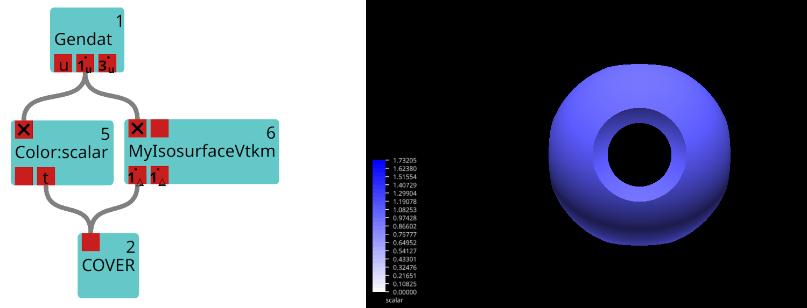
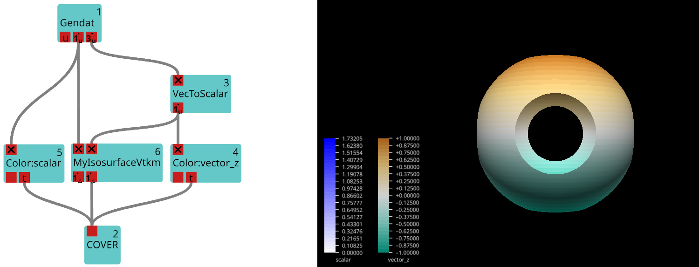
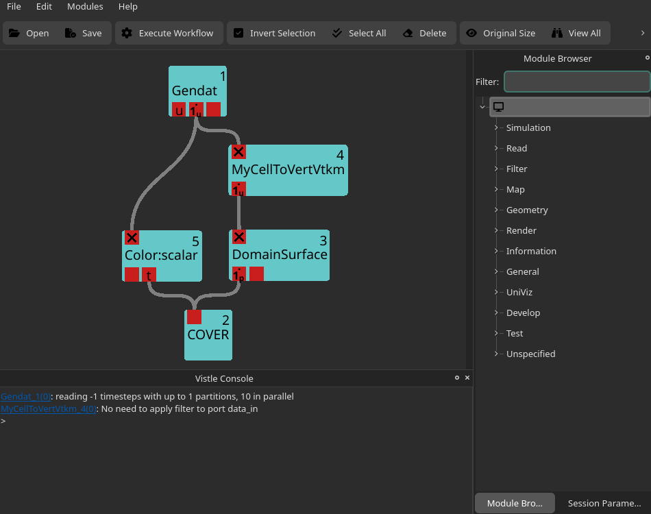

# How to Write a GPU Module

This guide explains how to write Vistle modules that can be run on the GPU. It assumes you are familiar with the [basics on how to write a Vistle module](implementation-basics.md).   

Vistle makes use of the portable toolkit [Viskores](https://m.vtk.org/). It was originally developed as VTK-m (Bolstad et al., 2023[^vtkm]), and this still shows in many places within Vistle. It allows running scientific visualization algorithms on various devices, including GPUs, and is designed to keep data transfers between devices at a minimum.

## Overview
- [How to Write a GPU Module](#how-to-write-a-gpu-module)
- [The VtkmModule Class](#the-vtkmmodule-class)
- [Example 1: Basic usage](#example-1-basic-usage)
- [Example 2: Extending the Core Functionality](#example-2-extending-the-core-functionality)
- [Custom Viskores Filters](#custom-viskores-filters)
- [How to Configure Vistle to Run Viskores Modules on the GPU](#how-to-configure-vistle-to-run-viskores-modules-on-the-gpu)

## The VtkmModule Class

The class `VtkmModule` is the base class for Viskores modules in Vistle. It is designed to make adding new Viskores algorithms, so-called [filters](https://viskores.readthedocs.io/en/stable/provided-filters.html), as simple as possible by providing core functionality for handling the input data, passing it to the filter implemented by the derived class, and writing the filter result to the output ports. At the same time, it is meant to be flexible, allowing the derived class to customize and extend these processes, if desired.

In order to implement a module wrapping a filter provided by or relying on Viskores, one implements a class deriving from `VtkmModule`.

**Note:** The class `VtkmModule` derives from `Module`, i.e.,  many of its features, like the functionality for adding module parameters, can be used by Viskores modules, too.

### The Constructor

The `VtkmModule` constructor, which the derived class should call in its own constructor, creates the input and output ports of the Viskores module.

```cpp
VtkmModule(const std::string &name, int moduleID, mpi::communicator comm, int numPorts = 1, MappedDataHandling mode = MappedDataHandling::Require);
```

By default, a Viskores module provides one input port and one output port, but additional ports can be added by specifying the desired number in the base constructor (`numPorts`). Note that all data on the input ports must be defined on the same grid, as the module will throw an error, otherwise.

Many Viskores filters work on data fields, so, by default, a Viskores module expects the data at the input ports to contain mapped data in addition to a grid and will throw an error if there is none. The `MappedDataHandling` mode can be changed, if desired:
- `Use`: keep the existing mapped data and use it as is
- `Require`: mapped data is mandatory; if it is missing, the module aborts with an error
- `Discard`: mapped data is ignored and removed before exporting to Viskores
- `Generate`: if mapped data is absent, the module creates it automatically so the filter can still run

### Defining the Viskores Filter

The `setUpFilter` method, which must be implemented by the derived class, creates, sets up and returns the desired Viskores filter that will be called on the input data.  

```cpp
virtual std::unique_ptr<viskores::filter::Filter> setUpFilter() const = 0;
```
  
If the Viskores module has multiple input ports, the filter will only be applied to the data on the first input port, i.e., the filter's active field is set to the field on the first port. The fields on the remaining ports will be mapped to the resulting output grid.

### Preparing the Input Data

The `VtkmModule` class defines its own struct called `InputData` for encapsulating the input data in both the Vistle and the Viskores data formats:
```cpp
struct InputData {
    vistle::Object::const_ptr vistleGrid;
    std::vector<vistle::DataBase::const_ptr> fields;

    viskores::cont::DataSet viskoresDataset;
};
```
The struct makes sure that the modules have access to all the information they need when preparing the input (or output) for the filter.

The `prepareInputGrid` method transforms the input grid into a Viskores cellset and adds it to the Viskores dataset inside `input`. Similarly, `prepareInputField`, which is called once per field, transforms the input fields into Viskores array handles and adds them to `input.viskoresDataset` as well. The filter will, subsequently, be applied to `input.viskoresDataset`.
```cpp
virtual ModuleStatusPtr prepareInputGrid(InputData &input) const;

virtual ModuleStatusPtr prepareInputField(const vistle::Port *port, InputData &input, int index) const;
```

A Viskores module only performs very basic checks on the input ports while reading in the data, i.e., in the `readInPorts` method: It ensures each input port contains data as long as its corresponding output port is connected. Additionally, it makes sure that at least one input grid provides an input grid and that all data fields are defined on the same grid.
Some filters might, however, require additional checks on the input data. These can be added by overriding `prepareInputGrid` and/or `prepareInputField` as needed.

### Preparing the Output Data

Similar to the input struct, the `VtkmModule` class also contains a struct (called `OutputData`) for the output data:

```cpp
struct OutputData {
    vistle::Object::const_ptr vistleGrid;
    std::vector<vistle::DataBase::ptr> fields;

    viskores::cont::DataSet viskoresDataset;
};
```

`prepareOutputGrid` and `prepareOutputField`, which is called once per field, transform the filter result into the Vistle format, so it can be added to the module's output ports.

```cpp
virtual vistle::Object::const_ptr prepareOutputGrid(const InputData &input, OutputData &output) const;

virtual vistle::DataBase::ptr prepareOutputField(const InputData &input, OutputData &output, int index, const std::string &fieldName) const;
```

By default, the Viskores module simply copies the attributes from the input grid and fields to the output grid and fields, respectively. It also sets the output field's grid to the output grid. To account for possible attribute changes after applying the filter, e.g., when the filter changes the field's mapping from element- to cell-based, the derived class can override these two methods as needed.

## Example 1: Basic usage

This first example illustrates how to use the base functionalities of the `VtkmModule` class. It will create a Viskores module **MyIsosurfaceVtkm** which calls [Viskores's Contour filter](https://viskores.readthedocs.io/en/stable/provided-filters.html#contour) to generate an isosurface.


### The Header
Let's first inspect the new module's header file:

```cpp
#ifndef VISTLE_MYISOSURFACEVTKM_MYISOSURFACEVTKM_H
#define VISTLE_MYISOSURFACEVTKM_MYISOSURFACEVTKM_H

#include <vistle/vtkm/vtkm_module.h>

class MyIsosurfaceVtkm: public vistle::VtkmModule {
public:
    MyIsosurfaceVtkm(const std::string &name, int moduleID, mpi::communicator comm);

private:
    vistle::FloatParameter *m_isovalue;

    std::unique_ptr<viskores::filter::Filter> setUpFilter() const override;
};

#endif
```

As the goal is to use Viskores to run the algorithm on the GPU, the module inherits from the `VtkmModule` class which is defined in `vistle/vtkm/vtkm_module.h`:

```cpp
class MyIsosurfaceVtkm: public vistle::VtkmModule {
```

Because of inheriting from said class, `MyIsosurfaceVtkm` must override the `setUpFilter()` method to prepare the desired filter to be applied to the input dataset:
```cpp
std::unique_ptr<viskores::filter::Filter> setUpFilter() const override;
```

The Contour filter needs an isovalue. Since `VtkmModule` inherits from the `Module` class, we can simply define a float parameter for this purpose:
```cpp
vistle::FloatParameter *m_isovalue;
```

### The Source File

Next, the corresponding source file will be discussed:
```cpp
#include <viskores/filter/contour/Contour.h>

#include "MyIsosurfaceVtkm.h"

MODULE_MAIN(MyIsosurfaceVtkm)

using namespace vistle;

MyIsosurfaceVtkm::MyIsosurfaceVtkm(const std::string &name, int moduleID, mpi::communicator comm)
: VtkmModule(name, moduleID, comm, 2)
{
    m_isovalue = addFloatParameter("isovalue", "isovalue", 0.0);
}

std::unique_ptr<viskores::filter::Filter> MyIsosurfaceVtkm::setUpFilter() const
{
    auto filter = std::make_unique<viskores::filter::contour::Contour>();
    filter->SetIsoValue(m_isovalue->getValue());

    return filter;
}

```

Like any Vistle module, Viskores modules must also call the `MODULE_MAIN` function to make sure it is integrated correctly into the software:
```cpp
MODULE_MAIN(MyIsosurfaceVtkm)
```

The constructor must call the base constructor:
```cpp
MyIsosurfaceVtkm::MyIsosurfaceVtkm(const std::string &name, int moduleID, mpi::communicator comm)
: VtkmModule(name, moduleID, comm, 2)
{
    m_isovalue = addFloatParameter("isovalue", "isovalue", 0.0);
}
```
The base constructor lets us choose the number of ports (here, it is two). This means that the Contour filter will use the data field on the first input port to create the isosurface. The data on the second port will then simply be mapped to the resulting geometry.   
The constructor can be used to define module parameters, such as the isovalue in this case.

Finally, we create a Contour filter in the `setUpFilter` method, pass the isovalue to it and return it:

```cpp
std::unique_ptr<viskores::filter::Filter> MyIsosurfaceVtkm::setUpFilter() const
{
    auto filter = std::make_unique<viskores::filter::contour::Contour>();
    filter->SetIsoValue(m_isovalue->getValue());

    return filter;
}
```

### Adding the Module to Vistle

Adding a Viskores module to Vistle is similar to adding a regular module to Vistle. In the module's `CMakeLists.txt`, we call the `add_vtkm_module` target which makes sure the correct Viskores libraries are linked in addition to all necessary Vistle libraries:
```cmake
set(HEADERS MyIsosurfaceVtkm.h)
set(SOURCES MyIsosurfaceVtkm.cpp)

add_vtkm_module(MyIsosurfaceVtkm "Basic GPU module using Viskores's Contour filter" ${HEADERS} DEVICE_SOURCES ${SOURCES})
```

Note the use of the keyword `DEVICE_SOURCES`, which is particularly important for Viskores modules consisting of multiple source files. It ensures that the files are processed correctly by device compilers such as `nvcc`.

Then, we must choose the module category which fits best and add the new subdirectory to the corresponding `CMakeLists.txt` file:
```cmake
add_subdirectory(MyIsosurfaceVtkm)
```

### The Result

The code above produces a Vistle module **MyIsosurfaceVtkm** which consists of two input and output ports as well as a float parameter to set the isovalue and which calculates the isosurface using Viskores's Contour filter.

The data field on the first input port is used to calculate the isosurface. In the following example workflow, **MyIsosurfaceVtkm** reads in the data field named *scalar* and uses it to create an isosurface of isovalue 1.1:



Since **scalar** is the data field on the first input port and was thus used as the filter's active field, the data field on the first output port is uniform on the resulting output geometry.

For comparison, a second input field called `vector_z` is connected to **IsosurfaceVtkm** in the following example workflow:


The resulting geometry remains the same because the data on the first input port and the isovalue have not changed. The second output port returns the data field `vector_z` mapped to the output grid, which leads to a different coloring of the geometry.

## Example 2: Extending the Core Functionality

In this second example, the derived class will change the methods for handling its input and output data. The new class **MyCertToVellVtkm** will call the [Point Average filter](https://viskores.readthedocs.io/en/stable/provided-filters.html#point-average) to transform a cell-based data field into an equivalent vertex-based field. It, however, only applies the filter if the input data is cell-based. If not, it simply adds the input field to the output port.

### The Header File

To implement the desired behaviour, `MyCellToVertVtkm` overrides the `prepareInputField`, `prepareOutputGrid` and `prepareOutputField` methods:

```cpp
#ifndef VISTLE_MYCELLTOVERTVTKM_MYCELLTOVERTVTKM_H
#define VISTLE_MYCELLTOVERTVTKM_MYCELLTOVERTVTKM_H

#include <array>
#include <vistle/vtkm/vtkm_module.h>

class MyCellToVertVtkm: public vistle::VtkmModule {
public:
    MyCellToVertVtkm(const std::string &name, int moduleID, mpi::communicator comm);

private:
    ModuleStatusPtr prepareInputField(const vistle::Port *port, InputData &input, int index) const override;

    std::unique_ptr<viskores::filter::Filter> setUpFilter() const override;

    vistle::Object::const_ptr prepareOutputGrid(const InputData &input, OutputData &output) const override;

    vistle::DataBase::ptr prepareOutputField(const InputData &input, OutputData &output, int index,
                                             const std::string &fieldName) const override;
};

#endif
```

### The Source File

The following is **MyCellToVertVtkm**'s complete source file. In this section, the overridden methods will be explained one by one.

```cpp
#include <viskores/filter/contour/Contour.h>
#include <viskores/filter/field_conversion/PointAverage.h>

#include "MyCellToVertVtkm.h"

MODULE_MAIN(MyCellToVertVtkm)

using namespace vistle;

MyCellToVertVtkm::MyCellToVertVtkm(const std::string &name, int moduleID, mpi::communicator comm)
: VtkmModule(name, moduleID, comm)
{}

std::unique_ptr<viskores::filter::Filter> MyCellToVertVtkm::setUpFilter() const
{
    return std::make_unique<viskores::filter::field_conversion::PointAverage>();
}

ModuleStatusPtr MyCellToVertVtkm::prepareInputField(const vistle::Port *port, InputData &input, int index) const
{
    auto field = input.fields[index];
    auto mapping = field->guessMapping(input.vistleGrid);

    if (mapping == DataBase::Element) {
        return VtkmModule::prepareInputField(port, input, index);
    }
    return Info("No need to apply filter to port " + port->getName());
}

vistle::Object::const_ptr MyCellToVertVtkm::prepareOutputGrid(const InputData &input, OutputData &output) const
{
    return input.vistleGrid;
}


vistle::DataBase::ptr MyCellToVertVtkm::prepareOutputField(const InputData &input, OutputData &output, int index,
                                                           const std::string &fieldName) const
{
    // if filter was applied ...
    if (output.viskoresDataset.HasField(fieldName)) {
        // ... add its output to the output port
        auto outputField = VtkmModule::prepareOutputField(input, output, index, fieldName);
        outputField->setMapping(DataBase::Vertex);
        return outputField;
    } else {
        // ... otherwise just copy the input field
        auto ndata = input.fields[index]->clone();
        ndata->setGrid(input.vistleGrid);
        updateMeta(ndata);

        return ndata;
    }
}
```

Like any Viskores module, **MyCellToVertVtkm** must define and set up its desired filter in the `setUpFilter()` method:

```cpp
std::unique_ptr<viskores::filter::Filter> MyCellToVertVtkm::setUpFilter() const
{
    return std::make_unique<viskores::filter::field_conversion::PointAverage>();
}
```

Before transforming the input field into a Viskores field, **MyCellToVertVtkm** first determines the field's mapping using the `guessMapping` method. If the field is element-based (=cell-based), the `prepareInputField` method of the base class is called to add the field to the Viskores dataset that will be passed to the Viskores filter. Otherwise, nothing happens, only an informational message will be printed to the GUI.

```cpp
ModuleStatusPtr MyCellToVertVtkm::prepareInputField(const vistle::Port *port, InputData &input, int index) const
{
    auto field = input.fields[index];
    auto mapping = field->guessMapping(input.vistleGrid);

    if (mapping == DataBase::Element) {
        return VtkmModule::prepareInputField(port, input, index);
    }
    return Info("No need to apply filter to port " + port->getName());
}
```

**Note:** `ModuleStatusPtr` is used to pass module states to `VtkmModule` which handles the states through its `checkAndNotify` method. Currently, there are four states: `Success()`, `Info(const std::string &message)`, `Warning(const std::string &message)`, `Error(const std::string &message)`. Returning the latter three, results in `VtkmModule` printing `message` to the GUI's Vistle Console. Returning an `Error` state will stop the execution of the module, but not cause Vistle to crash.

In this example, the output grid is the same as the input grid. As there is no reason to convert the filter's output grid back to Vistle, we can skip this step:

```cpp
vistle::Object::const_ptr MyCellToVertVtkm::prepareOutputGrid(const InputData &input, OutputData &output) const
{
    return input.vistleGrid;
}
```

Note, however, that you should not return a `nullptr` here, otherwise the output ports will remain empty, even if the filter did produce a valid output.

The field we return in the `prepareOutputField` method is the field that will be passed to the output port (as long as the field is not a `nullptr`, in that case only the output grid will be added to the port). We can use this to achieve the desired behavior: If the filter was applied, i.e., the input data field was cell-based, we want to add the filter's result to the output port.
If the filter was not applied, i.e., the input field was vertex-based, we simply add the input field to the output port.
```cpp
vistle::DataBase::ptr MyCellToVertVtkm::prepareOutputField(const InputData &input, OutputData &output, int index,
                                                           const std::string &fieldName) const
{
    // if filter was applied ...
    if (output.viskoresDataset.HasField(fieldName)) {
        // ... add its output to the output port
        auto outputField = VtkmModule::prepareOutputField(input, output, index, fieldName);
        outputField->setMapping(DataBase::Vertex);
        
        return outputField;
    } else {
        // ... otherwise just copy the input field
        auto ndata = input.fields[index]->clone();
        ndata->setGrid(input.vistleGrid);
        updateMeta(ndata);

        return ndata;
    }
}
```

By default, `VtkmModule::prepareOutputField` sets the output field's grid to the output grid (which we have previously set to the input grid) and additionally copies the input field's attributes to the output field. As the filter changed the field's mapping, we must set it to vertex-based using `setMapping`.

### The Result
The code above creates the **MyCellToVertVtkm** module which consists of one input and one output port. It checks if it makes sense to apply the Point Average filter to the input field, i.e., it checks if the input field is cell-based. If so, the filter is applied. If not, an informational message is printed to the Vistle Console:


## Custom Viskores Filters

For simplicity, predefined Viskores filters have been used for the two examples above. Please note, that `VtkmModule` can, of course, also be used to add custom Viskores filters to Vistle. To learn more about implementing custom Viskores filters, check out [Viskores's user guide](https://viskores.readthedocs.io/en/stable/basic-filter-impl.html) (Moreland, 2024[^vtkmguide]).

## How to Configure Vistle to Run Viskores Modules on the GPU

Viskores is an open-source software that can be obtained through [GitHub](https://github.com/Viskores/viskores). It was added as submodule to the Vistle repository, so that Vistle can handle configuring Viskores appropriately for the user. 

### CUDA build
This build is recommended for NVIDIA GPUs. 

To compile Vistle with the CUDA version of Viskores, run the following commands from your build directory:

```bash
cmake -DVISTLE_USE_CUDA=ON ..
make
```

Make sure the CUDA compiler is found (e.g., by checking `CMAKE_CUDA_COMPILER` after configuring cmake) before compiling, otherwise the CPU version of Vistle will be built.

### Kokkos build
This build has been tested on AMD and NVIDIA GPUs.

To compile Vistle with the Kokkos version of Viskores, you will first need to install Kokkos on your system and enable the desired backends. You can either install it with the package manager of your choice or by yourself from source (see [Kokkos's GitHub](https://github.com/kokkos/kokkos) repository). In the latter case, please consult the [Kokkos documentation](https://kokkos.org/kokkos-core-wiki/get-started/building-from-source.html#configuring-and-building-kokkos) for the appropriate build options for your system.

**Important:** Make sure `Kokkos_ENABLE_THREADS` is `OFF`.

 Once Kokkos is installed, run the following commands from your Vistle build directory:

```bash
cmake -DVISTLE_USE_KOKKOS=ON ..
make
```

If Kokkos isn't found automatically (which is typically the case if Kokkos was installed in a non-standard location), add `-DKokkos_DIR=<path to your Kokkos installation>/lib/cmake/Kokkos` to the `cmake` command.

Vistle will detect which backends have been enabled in your Kokkos build and configure the Viskores submodule accordingly.

**Please note:** If you enabled the CUDA version of Kokkos, Vistle will build both the CUDA and Kokkos (+CUDA) version of Viskores. By default, Viskores prefers CUDA over Kokkos. To make Vistle use the Kokkos version of Viskores, set the `VISKORES_DEVICE` environment variable to `Kokkos` before running vistle:
```
export VISKORES_DEVICE=Kokkos
vistle
```
**NOTE:** All environment variables recognized by [viskores::cont::Initialize](https://viskores.readthedocs.io/en/v1.0.0/initialization.html#_CPPv4N8viskores4cont10InitializeERiA_Pc17InitializeOptions) can be used, including `VISKORES_LOG_LEVEL` which can be helpful for debugging.

[^vtkm]: Bolstad, M., Moreland, K., Pugmire, D., Rogers, D., Lo, L.T., Geveci, B., Childs, H., Rizzi, S.: VTK-m: Visualization for the Exascale Era and Beyond. In: ACM SIGGRAPH 2023 Talks, pp. 1–2 (2023). [https://doi.org/10.1145/3587421.3595466](https://doi.org/10.1145/3587421.3595466)

[^vtkmguide]: Moreland, K.: The VTK-m User’s Guide. Techreport ORNL/TM-2024/3443, Oak Ridge National Laboratory (2024). [https://gitlab.kitware.com/vtk/vtk-m-user-guide/-/wikis/home](https://gitlab.kitware.com/vtk/vtk-m-user-guide/-/wikis/home)
