# Example: Visualizing OpenFOAM Simulation Results

In this step-by-step tutorial you will learn how to visualize a sample CFD dataset created with [OpenFOAM](https://www.openfoam.com/).

## Overview
- [Example: Visualizing OpenFOAM Simulation Results](#example-visualizing-openfoam-simulation-results)
  - [Overview](#overview)
  - [Generating the Sample Dataset with OpenFOAM](#generating-the-sample-dataset-with-openfoam)
  - [Reading in the Simulation Results with `ReadFoam`](#reading-in-the-simulation-results-with-readfoam)
  - [Visualizing the Grid](#visualizing-the-grid)
  - [Visualizing a Scalar Data Field](#visualizing-a-scalar-data-field)
  - [Visualizing a Vector Data Field](#visualizing-a-vector-data-field)
  - [Adding Context to the Visualization](#adding-context-to-the-visualization)

## Generating the Sample Dataset with OpenFOAM

The input dataset for this sample visualization is the data generated by the motorbike simulation tutorial which comes with the OpenFOAM software. First, follow the instructions on [OpenFOAM's official website](https://www.openfoam.com/news/main-news/openfoam-v2412) to install the software on your system.

Next, open a terminal and set up the OpenFOAM environment:
```bash
source <OpenFOAM directory>/etc/bashrc
```
Replace `<OpenFOAM directory>` with the folder you installed OpenFOAM to, e.g., `/opt/OpenFOAM/OpenFOAM-v2412`. This sets up all necessary environment variables in your terminal, including `FOAM_TUTORIALS` which contains the path to the official tutorial simulation cases.

Create a working directory, navigate into it and copy the motorbike data into the new folder:
```bash
mkdir run && cd run
cp -r $FOAM_TUTORIALS/incompressible/simpleFoam/motorBike .
```

Navigate into the `motorBike` folder and run the simulation:

```bash
cd motorBike
./Allrun
```

This generates the simulation results we need for this tutorial.
Later on, we will also add the 3D model of the motorcyclist to the visualization, so as a final preparation step, we need to extract `motorBike.obj`:

```bash
cd constant/triSurface
gunzip motorBike.obj.gz 
```
## Reading in the Simulation Results with `ReadFoam`

Now, that we have generated the simulation results using OpenFOAM, we can open Vistle to read them in and create a visualization workflow.

To open Vistle, navigate to Vistle's root directory, i.e., the directory containing the Vistle repository, and execute the following in a terminal:
```bash
vistle
```

**Tip:** You can save the workflow anytime with the `File` &rarr; `Save`  buttons or  by using `CTRL` + `S`.

Locate the [ReadFoam](project:#mod-ReadFoam) module in the module browser and drag and drop it into the workflow area on the left:
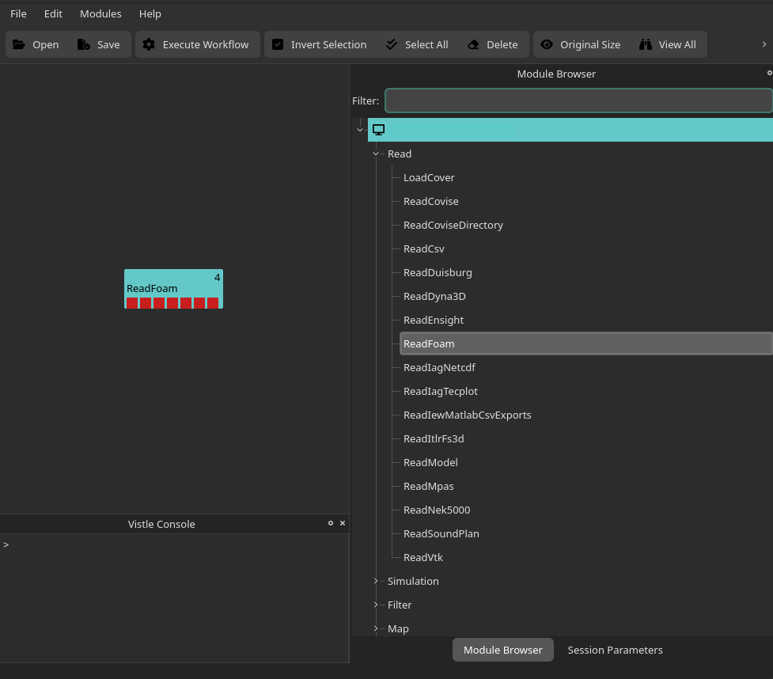

**Tip:** You can search for modules by name with the `Filter` search bar at the top of the module browser.

Left-click on the `ReadFoam` module to adjust its module parameters:

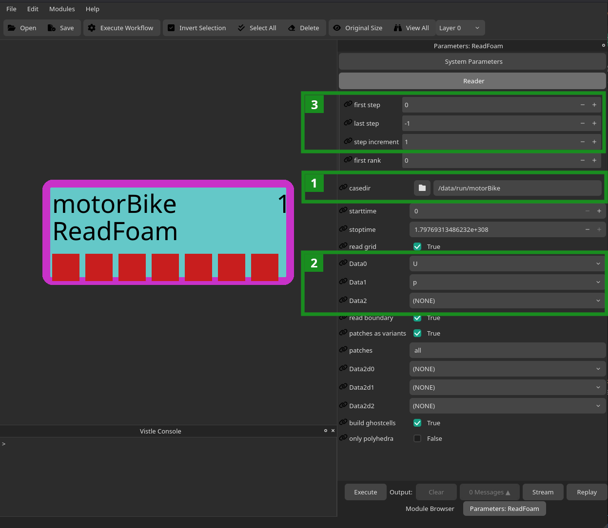

First, select the case directory containing the simulation data, i.e., the path to the `motorBike` folder we have created in the first section of this guide (see 1 in figure above), by either copying the full path into the text field or by browsing for it with the folder button.
Double-click on the `ReadFoam` module to execute it.

After executing the module once, you will be able to select up to three data fields of interest with the help of the drop-down lists `Data0`, `Data1` and `Data2` (see 2 in figure above). For the sake of this tutorial, we chose the vector field `U`, i.e., the air flow's velocity, as well as the scalar data field `p`, i.e., the pressure. 
The first port of `ReadFoam` now contains the data grid used in the simulation, the second one contains the three-dimensional velocity vector field and the third port the scalar pressure data field.

**Tip:** By default, all timesteps in a dataset are read in. For datasets consisting of a large number of timesteps or, generally, for very large datasets with multiple time steps, it is advisable to reduce the number of time steps when first creating the visualization workflow. This is because reducing the number of time steps will also reduce the execution time and RAM requirements of the visualization, which makes it easier to play around with different visualization modules and module parameters (even on a laptop). Once you are happy with the workflow, you can read in the entire dataset (if necessary, on a more powerful machine with more RAM). 

As for any reader module, you can select which timesteps to read in with the `Reader` settings in the module parameter menu (see 3 in figure above) You can specify the range of timesteps with the `first step` and `last step` parameters and also change the `step increment`. To, e.g., read in every 5th time step in the dataset, you would set `step increment` to 5, `first step` to 0 (this is the first time step) and `last step` to -1 (which is the last time step).

## Visualizing the Grid
While it is more typical to visualize the data fields mapped onto the grid generated by the simulation, it is, of course, also possible to visualize the grid itself.

One possible visualization workflow for grids is shown in the following figure:

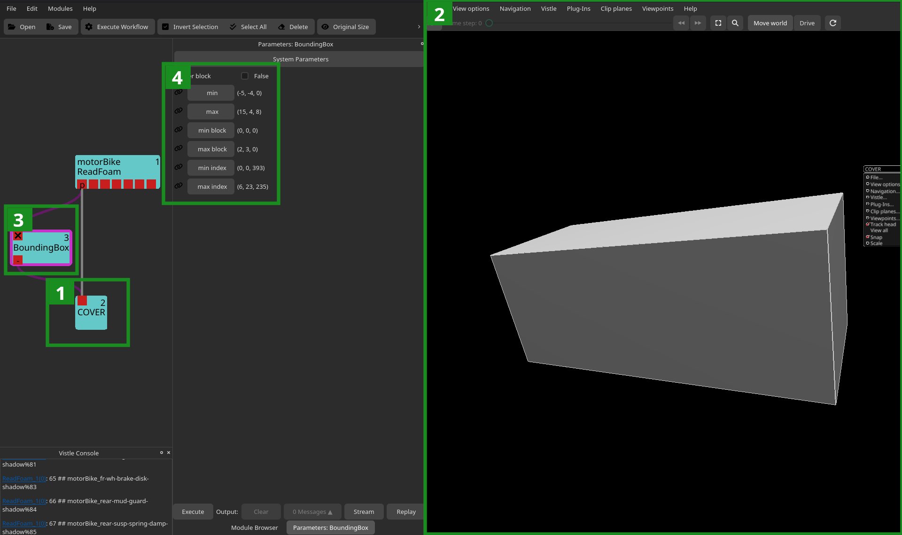

When adding the [](project:#mod-COVER) module (see 1 in figure above) to a visualization workflow, the renderer COVER is, by default, automatically opened on the desktop (see 2 in figure above). Note that it can also be configured to be run in a VR environment with the `COCONFIG` environment variable.

Since the grid returned by `ReadFoam` is a polygon grid, i.e., a geometry, we can directly connect it to the `COVER` module to visualize it. For other grid types, like uniform or unstructured grids, we would have to place the [](project:#mod-DomainSurface) module before COVER.

The [](project:#mod-BoundingBox) module (see 3 in figure above) can be used to visualize the bounding box of a grid. It also provides information on the grid's extrema (see 4 in figure above).

## Visualizing a Scalar Data Field
In this section we will discuss a typical visualization workflow for scalar data fields, such as the pressure field in the motorbike sample dataset:

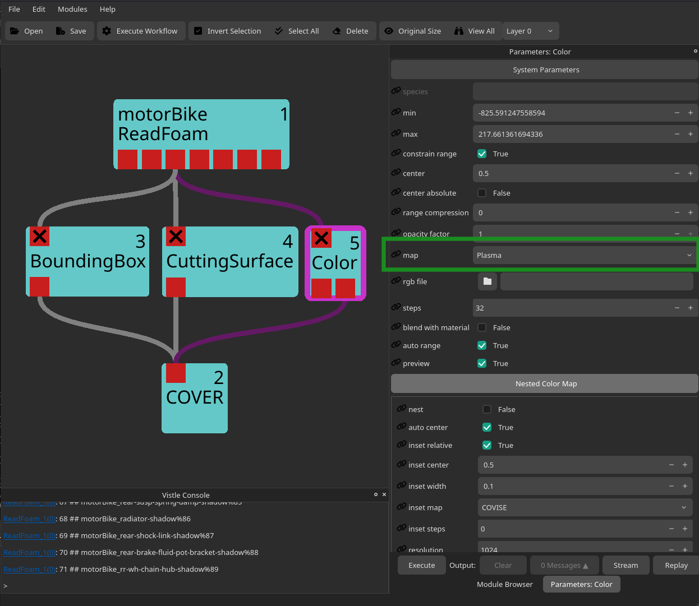

Each data field, be it scalar or vector, can be mapped to colors with the [](project:#mod-Color) module. When connecting its second port to `COVER`, the desired color map (in this example `Plasma`) will automatically be applied to each rendered object which contains (part of) the scalar field.  
**Tip:** Use different color maps for different data fields.

The color map (see 2 in figure below) can be added to the renderer by toggling the `Show` button (see 1 in figure below; `Vistle` &rarr; `Colors` &rarr; `Color_x` (where x is the ID of the `Color` module, this can be seen in the top right corner of the Vistle module) &rarr; `Show`): 
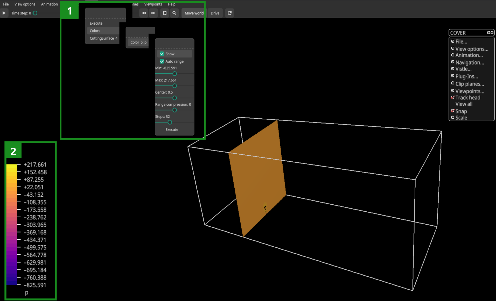


The [](project:#mod-CuttingSurface) module cuts a three-dimensional grid along basic geometries, such as planes, spheres or cylinders. For this example, we cut the grid using a plane. There are two ways to the define the cutting geometry, either by adjusting the module parameters:

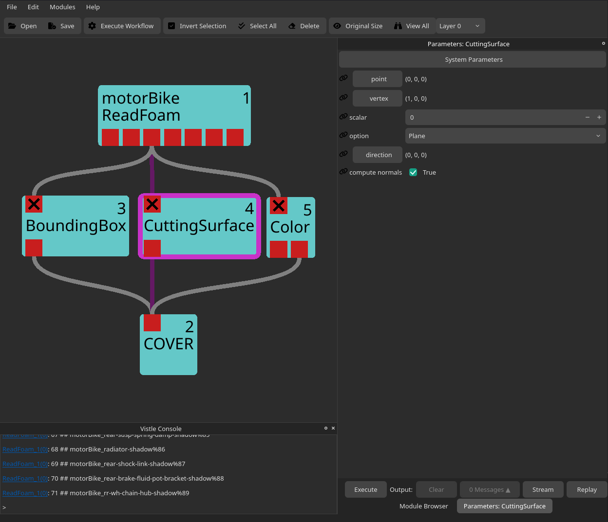

Or, interactively in the renderer by using a pick interactor:

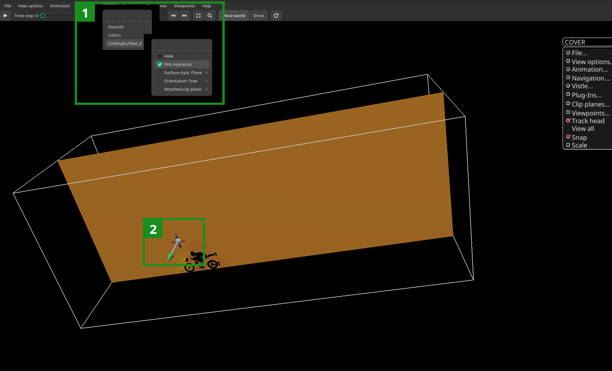

The pick interactor (see 2 in figure above) can be enabled by clicking the `Vistle` tab at the top of the renderer, selecting the correct `CuttingSurface_x` entry (x is the ID of the desired `CuttingSurface` module which is displayed at the top right corner of the module rectangle) and setting `Pick Interactor` to true (see 1 in figure above). In a desktop environment, the pick interactor can be moved by dragging the end of the arrow to the desired position and rotated by moving the tip of the arrow.

## Visualizing a Vector Data Field

One way to visualize vector data fields, such as the velocity field U, is by using streamlines which can be generated with the [](project:#mod-Tracer) module. To make the resulting streamlines more easily visible, the output of the `Tracer` module is typically passed to the [](project:#mod-Thicken) and [](project:#mod-ToTriangles) modules before rendering:

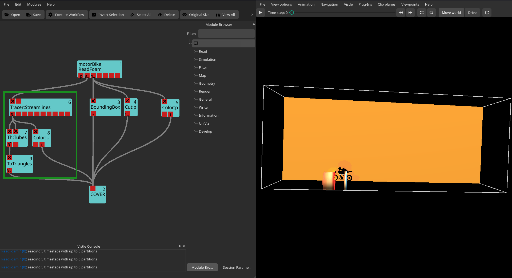

As we can see in the figure above, the default tube width of the `Thicken` module is too large for the dataset at hand. We can adjust the width by changing the module parameters:

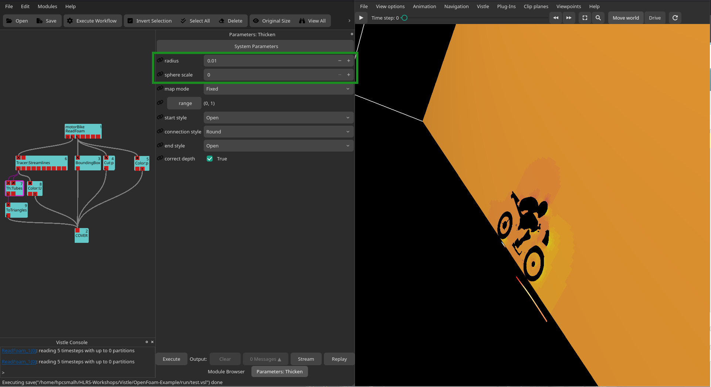

In the `Tracer`'s module parameter menu, we can increase the number of generated streamlines with the `no startp`-parameter and their length through the `trace len`-parameter. The initial position of the stream lines can be defined though different geometries, such as lines, planes or cylinders. These geometries can either be defined by the `startpoint1`-, `startpoint2`- and `direction`-parameters or by a pick interactor:

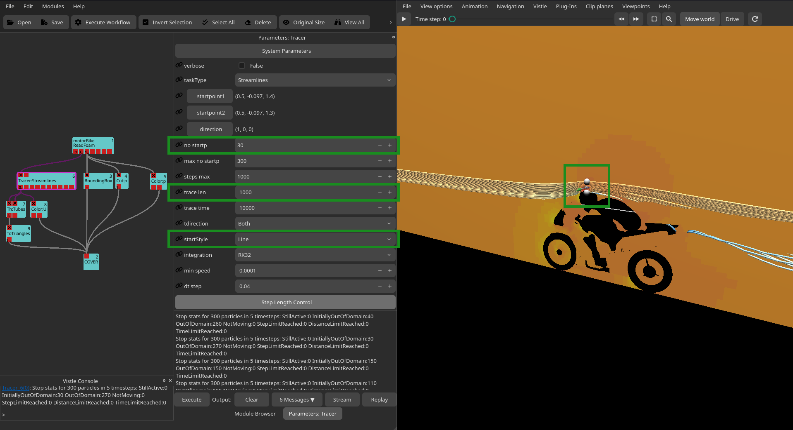

How to enable pick interactors is described in the [Visualizing a Scalar Data Field](#visualizing-a-scalar-data-field) section above.

## Adding Context to the Visualization

Adding 3D models,  e.g., of the involved objects or the environment, to simulation data results helps make the visualization easier to understand. 3D models, e.g., created in modelling software like [Blender](https://www.blender.org/) or [3ds Max](https://www.autodesk.com/products/3ds-max/free-trial) can be loaded into COVER using either the [](project:#mod-LoadCover) or [](project:#mod-ReadModel) module. Simply specify the path to the model in the module parameters:
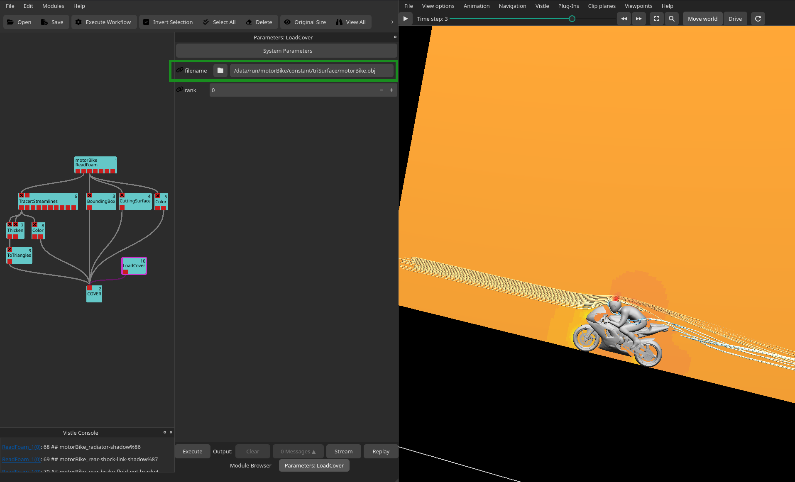
