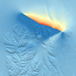
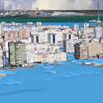

Gallery
*******

.. toctree::
   :hidden:

   video.rst
   ihs.rst
   sc14.rst
   itlr.rst
   husavik.rst
   cadiz.rst

.. |video| image:: vistle-in-a-minute.png
   :target: https://youtu.be/VmQoeH2Q2Uc

.. |ihs| image:: vistle-ihs-small.jpg
   :target: ihs.html

.. |sc14| image:: vistle-remote-small.jpg
   :target: sc14.html

.. |itlr| image:: vistle-itlr-small.jpg
   :target: itlr.html

|video| "Vistle in a Minute" - a short demonstration of Vistle (`English <http://reserv.at/vistle/vistle_en.m4v>`__, `Deutsch <http://reserv.at/vistle/vistle_de.m4v>`__)

|ihs|   Flow in a pump turbine in `CAVE <http://hlrs.de/cave/>`__ at HLRS, simulation conducted by `IHS <https://www.ihs.uni-stuttgart.de/>`__

|sc14|  Hybrid remote rendering at `SC '14 <http://sc14.supercomputing.org/>`__ in New Orleans on HLRS `visualization cluster <http://hlrs.de/cave/>`__ in Stuttgart

|itlr| Jet break up in non-Newtonian fluid, simulation by `ITLR <https://www.itlr.uni-stuttgart.de/>`__

|husavik| The Húsavík-Flatey Fault Zone in North Iceland, courtesy of `ChEESE <https://cheese-coe.eu/publications/dynamic-earthquake-rupture-scenarios-and-physics-based-seismic-hazard-assessment>`__

|cadiz| Simulated tsunami in Cadiz, courtesy of `ChEESE <https://cheese-coe.eu>`__
