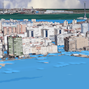

Vistle -- Distributed Data-parallel Scientific Visualization in VR
******************************************************************

`Vistle <https://github.com/vistle/vistle>`__ is an extensible software environment that integrates simulations on supercomputers, post-processing and parallel interactive visualization in immersive virtual environments.

It is under active development at `HLRS <https://www.hlrs.de>`__ since 2012. The objective is to provide a highly scalable visualization tool, exploiting data, task and pipeline parallelism in hybrid shared and distributed memory environments with acceleration hardware. Domain decompositions used during simulation can be reused for visualization.

A Vistle work flow consists of several processing modules, each of which is a parallel MPI program that uses OpenMP within nodes. These can be configured graphically or from Python. Shared memory is used for transferring data between modules on a single node. Work flows can be distributed across several clusters.

For rendering on desktop and in immersive projection systems, Vistle uses `OpenCOVER <https://www.hlrs.de/opencover>`__. Visualization parameters can be manipulated from within the virtual environment. Large data sets can be displayed with OpenGL sort-last parallel rendering and depth compositing. For scaling with the simulation on remote HPC resources, a CPU based hybrid sort-last/sort first parallel ray casting renderer is available. “Remote hybrid rendering” allows to combine its output with local rendering, while ensuring smooth interactivity by decoupling it from remote rendering.

The Vistle system is modular and can be extended with additional visualization algorithms. Source code is available on `GitHub <https://github.com/vistle/vistle>`__ and licensed under the `LPGL (version 2 or newer) <https://spdx.org/licenses/LGPL-2.0-or-later.html>`__.

.. _install-docs:

Installation
------------

Refer to the top level `README.md <https://github.com/vistle/vistle?tab=readme-ov-file#installation>`__ for basic installation instructions.

|video| |ihs| |sc14|

|itlr| |husavik| |cadiz|

..
   * :ref:`install-docs`
   * :ref:`user-docs`
   * :ref:`dev-docs`

Publications
------------

Our :doc:`publications <publications/index>` describe the :doc:`architecture <architecture/index>` and other characteristics of the Vistle system.

.. toctree::
   :maxdepth: 1
   :caption: Overview
   :hidden:

   Installation <self>
   Gallery <gallery/index.rst>
   Publications <publications/index.md>
   
.. _user-docs:

.. toctree::
   :maxdepth: 1
   :caption: User Documentation

   Quickstart <quickstart/quickstart.md>
   Introduction <intro/index.rst>
   Advanced Topics  <advanced/index.rst>
   Architecture <architecture/index.md>
   Module Reference <module/index.rst>

.. _dev-docs:

.. toctree::
   :maxdepth: 1
   :caption: Developer Documentation

   Conventions & Guidelines <develop/coding-style.md>
   API Overview <develop/api/index.rst>
   Creating Modules <develop/module/index.rst>
   Write & Build Documentation <develop/documentation/index.rst>

.. toctree::
   :maxdepth: 2
   :caption: Links

   HLRS (hlrs.de) <https://www.hlrs.de>
   OpenCOVER (hlrs.de/covise) <https://www.hlrs.de/solutions/types-of-computing/visualization/covise#:~:text=OpenCOVER>
   Source Code (github.com/vistle/vistle) <https://github.com/vistle/vistle>
   About <copyright>

.. |video| image:: gallery/vistle-in-a-minute.png
   :target: gallery/video.html

.. |ihs| image:: gallery/vistle-ihs-small.jpg
   :target: gallery/ihs.html

.. |sc14| image:: gallery/vistle-remote-small.jpg
   :target: gallery/sc14.html

.. |itlr| image:: gallery/vistle-itlr-small.jpg
   :target: gallery/itlr.html

.. |husavik| image:: gallery/vistle-husavik-small.png
   :target: gallery/husavik.html

