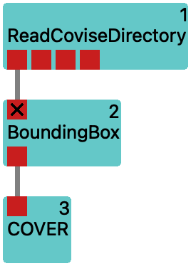
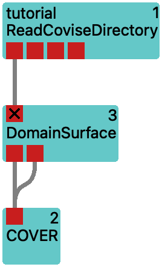
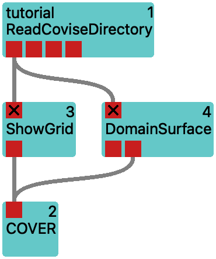
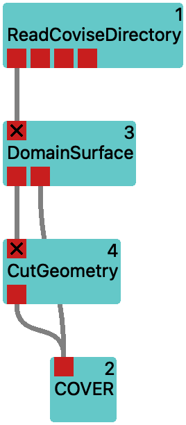
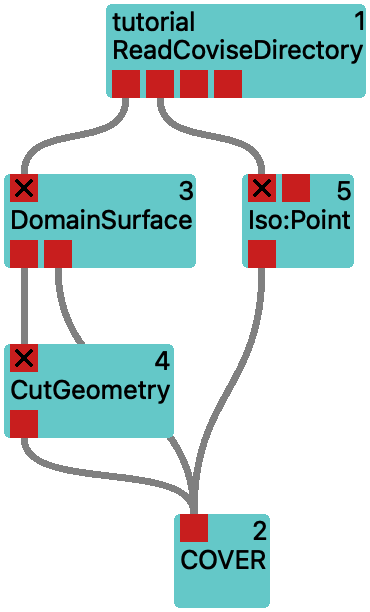
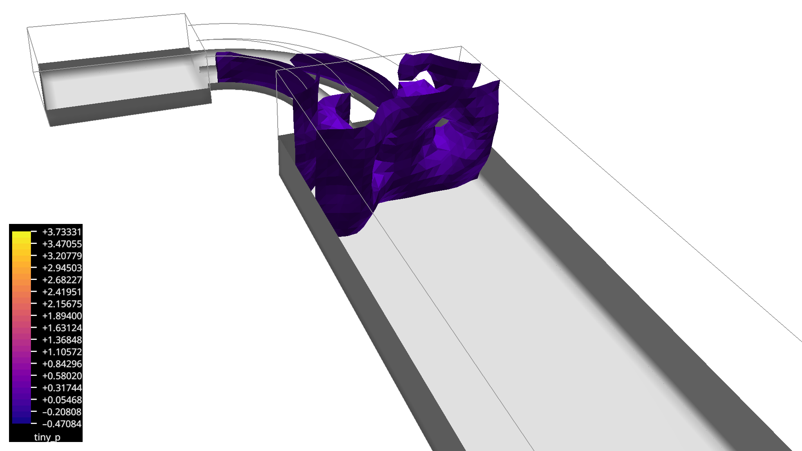
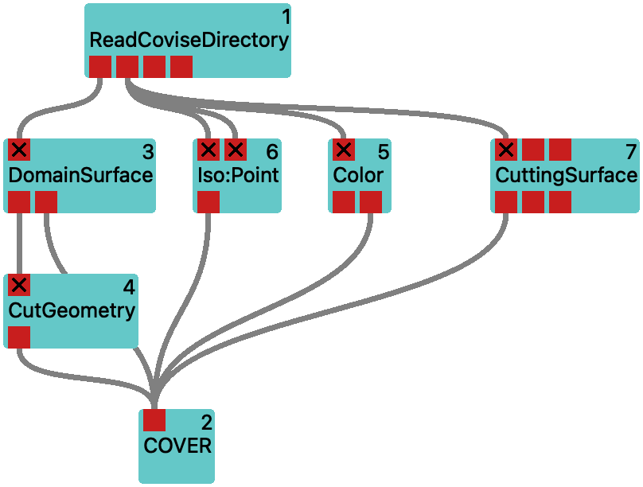
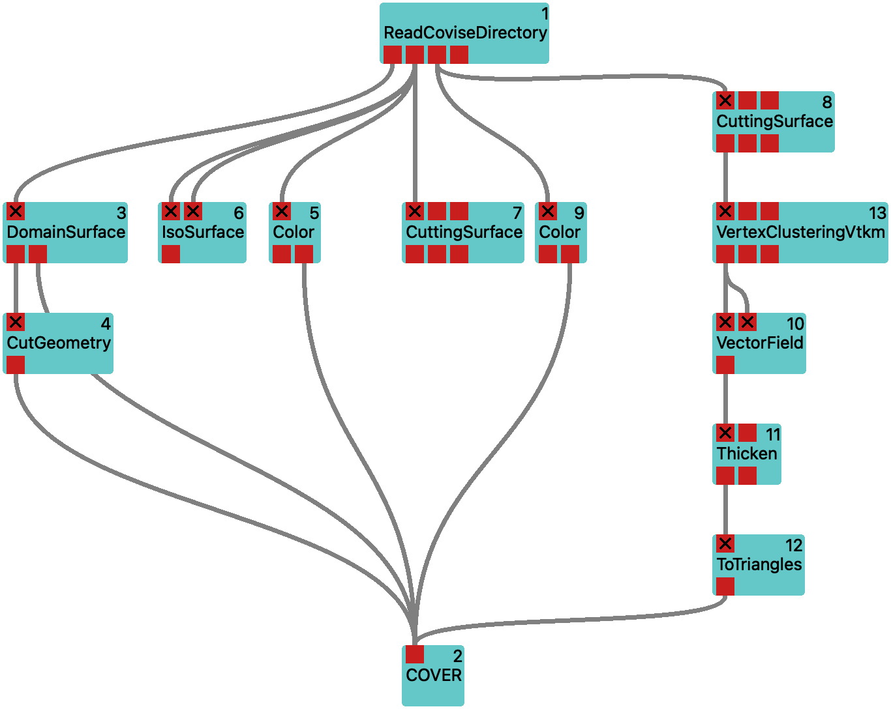

# A Simple CFD Example

In this section, we will study basic visualization techniques for scalar and vector fields by working with a small CFD data set.

:::{note}
We will build more and more complex workflows and proceed step by step.
You can find the corresponding workflows in the [Vistle source code repository](https://github.com/vistle/vistle) in the directory [.../workflow/tutorial](https://github.com/vistle/vistle/tree/master/workflow/tutorial).

If your browser is configured to open links of the form `vistle://...` with Vistle, you can open the workflows directly from this documentation.
:::

## The Data

The data that we will work with is the same as used in the [COVISE tutorial](https://fs.hlrs.de/projects/covise/doc/html/tutorial/index.html). It is distributed in the [COVISE source repository](https://github.com/hlrs-vis/covise/) and comes with every COVISE installation in the subdirectory `.../share/covise/example-data/tutorial`. You can also get it by downloading the raw contents of the files in [this directory](https://github.com/hlrs-vis/covise/tree/master/share/covise/example-data/tutorial) from GitHub. It is provided in native COVISE format. It shows the results of a flow simulation in a channel with two inlets and contains scalar data fields for pressure (`tiny_p.covise`), temperature (`tiny_te.covise`) and viscosity (`tiny_vis.covise`) as well as the velocity vector field (`tiny_ve.covise`) on an unstructured grid (`tiny_geo.covise`).

### Reading the Data

Reading of data in COVISE format is accomplished with the  or  modules. Both can read up to three fields mapped onto the same grid. The first can handle grid and field data at arbitrary locations in the filesystem. The latter requires that grid and field data reside in the same directory – with the advantage of a more comfortable user interface for selecting the fields to be read.

To start, drag *ReadCoviseDirectory* from the module library to the empty canvas in the center of the graphical user interface. This will start the module and show a representation of it as a turquoise box.
Then continue with selecting the directory where to find the data. This is a [parameter](../gui/gui.md#module-browser-and-parameters) of the module.
Select the module by clicking on the turquoise box. A pink outline indicates that this module is selected.
The user interface will show the parameters of this module in the [parameter area](../gui/gui.md#module-browser-and-parameters).
Make sure that only this module is selected -- otherwise the GUI will not enable the module parameters view.

In the area labeled *Parameters: ReadCoviseDirectory* find the line for the *directory* parameter and click on the folder icon.
This will bring up a file browser window.
Use it to navigate to the directory where you have the COVISE source code. From there, continue to `share/covise/example-data/tutorial` and click on *Choose*.
The module will search the directory for files with the extension `.covise` and will present them in the parameter combo boxes (drop down lists) for *grid*, *normals*, and the data fields *field0*, *field1*, ...

At this stage, we are only interested in the geometric structure of the computational domain.
So it is sufficient to select `tiny_geo` on the *grid* parameter.
Execute the workflow by double-clicking on the module or by clicking on the *gears* icon in the toolbar.

[Workflow geo-read](vistle:///open#workflow/tutorial/geo-read) shows the module with the selected directory and the grid file.

## Examining the Geometry

Here we will study techniques to visualize the geometry of the computational domain.
This will also help you to provide context for the visualization of the scalar and vector fields.

### Find the Extents of the Geometry Domain

The  module takes its geometry input and finds global minimum and maximum values for its coordinates. The result of this process can be seen in its parameter window as the values of the `min` and `max` parameters. And of course, it can compute a tight axis-aligned cuboid around the domain of the data. This surrounding box can guide you to the interesting areas of space, it can provide visual clues that help with orientation in 3D space.
The numerical values can be used to provide input for modules requiring coordinates as parameter input.

This bounding box can also be inspected visually by loading it into the  renderer. This will open up another window. Connect the output of *BoundingBox* to the input of *COVER* and rerun the workflow.
You can bring the bounding box into view by clicking on the *View All* icon in the toolbar right of the animation controls in the *COVER* window. This will show the bounding box in a light gray color.
In order to get an idea of the location and size of the bounding box, you can enable a unit sized coordinate system in the renderer by enabling it with the *View Options* -> *Show axis* in the menu of the *COVER* window.
The coordinate system will be shown in red, green, and blue colors for the *x*, *y*, and *z* axes, respectively.

:::{subfigure} A

:::
[Workflow geo-bounds](vistle:///open#workflow/tutorial/geo-bounds) shows how to compute and display geometry bounding box.

### Show the Boundary of the Geometry Domain

The shape of the computational domain can be visualized with the  module. It is available from its first, i.e. left-most output. After connecting it to *COVER* and executing the workflow, it will show the outer surface of the geometry in a light gray color.
If you are interested what triangles make up this surface, you can show visualize them by switching to *Wireframe* in the *View options* -> *Draw style* menu of *COVER*. This will show the outlines of the triangles.

It also provides a second output port providing lines showing the edges of the domain.
Currently, this is only a rough approximation, as only those edges that do not neighbor with other cells are shown.
Connect also this second output to the input of *COVER* and execute the workflow again.

:::{subfigure} ABBB

:::
[Workflow geo-surface](vistle:///open#workflow/tutorial/geo-surface) shows how to compute the geometric domain.

### Show the Tessellation of the Geometry Domain

Often, the computational domain is discretized by subdividing it into cells.
The module [ShowGrid](project:#mod-ShowGrid) can be used to visualize this subdivision.
Different to using *DomainSurface* together with the *Wireframe* draw style, this will show you what goes on inside the domain.

In order to peek into the domain, it is necessary to disconnect the first output of *DomainSurface* from the input of *COVER*.
Do so by double-clicking on the line representing this connection.
Then connect the output of *ShowGrid* to the input of *COVER* and execute the workflow again.

:::note
Showing the outline of a large number of cells can be very taxing on the graphics hardware,
especially for NVIDIA gaming cards.
Restrict the cells to show by selecting only specific types of cells or by supplying a list of cell IDs.
:::

:::{subfigure} ABBB

:::
[Workflow geo-grid](vistle:///open#workflow/tutorial/geo-grid) illustrates how to show a subset of the grid's cells.

### Clip Geometry at a Plane or Basic Shapes

You might want to see the inside of the computational domain, but still retain parts of the outer surface.
In order to do so, you need to cut the geometry open.
Vistle provides two modules for this purpose: the  and the  module.
They perform similar tasks, but are subject to different limitations.

* The *CutGeometry* module is able to process triangular and polygonal meshes and will ignore any mapped data (e.g. scalar or vector fields) on the geometry.

* The *ClipVtkm* module is able to process unstructured grids and will also clip mapped data. It is not able to work on polygonal (or general polyhedral) meshes.
As it is based on the [Viskores](../../advanced/accel/viskores.md) library, it is able to process large datasets in parallel.

We build on the workflow from the previous section. We want to show a bit of the outer shell of the domain, but also get a view inside.
So we add the add the *CutGeometry* module and connect its input to the first output of *DomainSurface* and its output to *COVER*.
You can adjust the location of the clip by switching to the *COVER* window and enabling the *Pick interactor* in the *Vistle* -> *CutGeometry_?* menu.
This will bring up a 3D manipulator in the *COVER* window.
Drag with the mouse on the sphere to move the plane and change its orientation by moving the tip of the arrow.
When satisfied, disable it again by deselecting the *Pick interactor* in the menu.

We also want to show cell structure within a spherical subset of the domain.
To do so, we add the *ClipVtkm* module and connect its input to the output of *ReadCoviseDirectory* and its output to the input of the existing *ShowGrid* module.
This will cut the direct connection between *ReadCoviseDirectory* and *ShowGrid*.
Make sure to enable visualization of all grid cells supplied to *ShowGrid* by changing its `cells` parameter to `all`.
Now continue to adjust the location of the clip by switching to the *COVER* window and enabling the *Pick interactor* in the *Vistle* -> *ClipVtkm_?* menu.
Also use this menu in order to change the *Surface style* from *Plane* to *Sphere*.
Also check the *Invert* menu entry to show the inside of the sphere.
You can adjust the sphere location by moving the sphere manipulator with the cross hairs in the *COVER* window and its radius by dragging the other sphere manipulator.

:::{subfigure} ABBB

:::
[Workflow geo-cut](vistle:///open#workflow/tutorial/geo-cut) illustrates the results of the geometry clipping operations.

## Visualizing Scalar Fields

Up to now, we have only looked at the geometry input for the simulation.
Let's continue with the scalar fields that have been generated by the simulation.

### Read in an Additional Scalar Field

In order to visualize the scalar fields, we need to read them in first.
We continue where we left off in the previous section.
We remove the the *ClipVtkm* branch from the workflow by selecting both the *ClipVtkm* and *ShowGrid* modules.
From the context menu on either of the selected modules, invoke *Delete Selected*.
Then we configure the *ReadCoviseDirectory* module to also read in the pressure field:
select the *ReadCoviseDirectory* module and select `tiny_p` from the list of available fields in the *field0* parameter.

:::{subfigure} ABBB

:::
[Workflow press-read](vistle:///open#workflow/tutorial/press-read) adds reading the pressure field.

### Explore Scalar Fields via Level Sets with the *IsoSurface* Module

The  module can be used to extract level sets from the scalar fields.
It will create a surface mesh that represents the points in the scalar field where a given value is found.
This technique is often used to visualize the shape of a scalar field.
We are going to apply it to the pressure field.
Add an *IsoSurface* module to the workflow and connect its first input to the second output (providing the pressure field) of *ReadCoviseDirectory*.
Then connect its output to the input of *COVER*.
Executing the workflow will show the surface of the pressure field in the *COVER* window.
You can adjust the isovalue by selecting the *IsoSurface* module and changing the `isovalue` parameter in its parameter window.
You can also use the slider in the *Vistle* -> *IsoSurface_?* menu to adjust the isovalue interactively.
Another way to adjust the isovalue is to enable the *Pick interactor* from this menu: now you can drag the sphere to choose a point that provides the isovalue.
For now, this isosurface will always be shown in a light gray color.

:::{subfigure} ABBB

:::
[Workflow press-iso](vistle:///open#workflow/tutorial/press-iso) explores the pressure field via level sets.

### Provide a Color Mapping/Transfer Function for the Scalar Field

Then add a  module to the workflow and connect its input to the second output of *ReadCoviseDirectory*.
This forwards the pressure field to the *Color* module, so that it can detect its minimum and maximum values.
This will be used to provide a color mapping (i.e. transfer function) for the pressure field on its second output.
Connect this to the *COVER* renderer.
Now, the *Vistle* -> *Color* menu in the *COVER* window will have an entry for this color map.
You can interact with the color map either via this *Color_?* sub-menu or via the *Color* module's parameter dialog in the user interface.
You can display a color legend by checking the *Show* entry in the *Color_?* sub-menu.
You will notice that this *Color* module carries the label `tiny_p`.
This means that this color map is used for all subsequent modules that are connected to the second output of *ReadCoviseDirectory*.
In the *Color* module's parameter dialog, you can also change the colors used for the color mapping by changing the value of `map`: the pressure field in these examples uses the *Plasma* color map instead of the default *CoolToWarmBrewer* color map.

Let's revisit our isosurface. What about coloring it according to the pressure field so that its color changes whenever we change the value?
For that purpose, the *IsoSurface* module provides a second input t˙hat provides a scalar field to map onto the isosurface.
So we connect the second output of *ReadCoviseDirectory* another time to *IsoSurface*, but now to its second input.
You could use the *Pick interactor* to adjust the isovalue interactively...

:::{subfigure} ABBB

:::
[Workflow press-color](vistle:///open#workflow/tutorial/press-color) explores the pressure field via level sets.

### Slice a Scalar Field with *CuttingSurface*

We finish exploring the pressure field by slicing it with the  module.
Add a *CuttingSurface* module to the workflow and connect its input to the second output of *ReadCoviseDirectory*.
Then connect its output to the input of *COVER*.
Execute the workflow and you will see a plane slicing through the pressure field.
You can adjust the position of the plane by selecting the *CuttingSurface* module and changing the `point` (a point on the plane) and `vertex` parameters in its parameter window.
Or you can use the *Vistle* -> *CuttingSurface_?* menu in the *COVER* window to adjust the position of the plane interactively by enabling the corresponding *Pick interactor*.
Now let's make use of the color mapping.

:::{subfigure} ABBB

:::
[Workflow press-cut](vistle:///open#workflow/tutorial/press-cut) shows the pressure field sliced with a plane.

## Visualizing Vector Fields
Now we will explore visualization of vector fields.

### Read in an Additional Vector Field
We continue with the workflow that we built in the previous section.
In order to get the pressure field out of the way, we disconnect the connection between the *IsoSurface* and the *CuttingSurface* modules and the *COVER* renderer by double-clicking on the line representing this connection.
Then we configure the *ReadCoviseDirectory* module to also read in the velocity field:
select the *ReadCoviseDirectory* module and select `tiny_velocity` from the list of available fields in the *field1* parameter.
This will add data to the third output of *ReadCoviseDirectory*.

:::{subfigure} ABBB

:::
[Workflow vel-read](vistle:///open#workflow/tutorial/vel-read) reads in the velocity field.

### Transform the Vector Field to a Scalar Field with *VecToScalar*

The techniques for studying scalar fields apply immediately to vector fields, if they are reduced to scalar fields, e.g. by computing the magnitude or extracting single components of the vector field.
The module  can be used for this purpose. This will allow to use the *IsoSurface* module to extract isosurfaces from the magnitude of vector field.
So let's try this!
We add a *VecToScalar* module to the workflow and connect its input to the third output of *ReadCoviseDirectory* with the velocity vector field.
It already defaults to computing the vector magnitude, which is what we want.
Then we add another *IsoSurface* module and connect its first input to the output of *VecToScalar*.
In order to make it easier to distinguish this isosurface from the domain surface, we add a *ColorAttribute* module.
It will instruct *COVER* to color its output in a constant color. We can choose this color by providing a hexadecimal tuple corresponding to #RRGGBB values for its `color` parameter, e.g. `#9999dd` for a light blue.
So we connect the output of *IsoSurface* to the input of *ColorAttribute*, and the output of the latter to *COVER*.

The default `isovalue` is `0`, so we adjust this to e.g `1`.

:::{subfigure} ABBB

:::
[Workflow vel-iso](vistle:///open#workflow/tutorial/vel-iso) extracts an isosurface of the velocity magnitude.

### Slice a Vector Field with *CuttingSurface* and Attach Line Glyphs with *VectorField*

We will not pursue the iso-contouring approach to vector fields much further, but rather use the vector field directly.
So we revert to the state of the workflow *vel-read* by removing the *IsoSurface*, *VecToScalar* and *ColorAttribute* modules for the velocity field from the workflow *vel-iso*.
As the module *Color* and the render modules will automatically use the magnitude of the vector field for color mapping, we do not even require the latter for coloring according to velocity.

We start by adding a *Color* module for the velocity and connect its input to the third output of *ReadCoviseDirectory* and its second output to *COVER*.
After selecting *Color*, we change the `map` to `Frosty`.
This will provide a map for coloring according to the velocity magnitude, and it will provide colors that are easy to distinguish from pressure values.

Now, we want to draw the vectors of the velocity field on a subset of the domain.
We can do this by using the *CuttingSurface* module again.
So we add another *CuttingSurface* module to the workflow and connect its input to the third output of *ReadCoviseDirectory*.
Then connect its output to the input of *COVER*.
This will show the plane defined by the cutting surface colored according to the velocity magnitude.
You can adjust its location with the *Pick interactor*, but be sure to choose the one corresponding to the new module from the menu.

:::{subfigure} ABBB

:::
[Workflow vel-cut](vistle:///open#workflow/tutorial/vel-cut)

We continue by adding a  module to the workflow and connect its input to the first output of *CuttingSurface*.
This will depict the velocity vectors on the cutting surface as lines.
Initially, these lines are rather long. We adjust that by setting the `scale` parameter of *VectorField* to `0.2`.
As some of the vectors are obstructed by the cutting surface, we remove the surface from the visualization by disconnecting the connection between *CuttingSurface* and *COVER*.
Instead, we apply the coloring to the lines themselves by connecting the first output of *CuttingSurface* to the second input of *VectorField*.
This way we can see the velocity direction from the direction of the lines, and the color together with the line length indicates the magnitude of the velocity.

:::{subfigure} ABBB

:::
[Workflow vel-lines](vistle:///open#workflow/tutorial/vel-lines)

### Thinning the Vector Field with *VertexClusteringVtkm* and Attaching Arrow Glyphs with *Thicken*

It would be nice to show the velocity vectors as arrows instead of lines.
We would not tell you this if it was not possible!
We need two additional modules for this: the  module to make tubes with arrow heads from the lines, and a  module to create triangle geometry from the abstract tubes -- *COVER* cannot render tubes directly, only the raytracing remote renderers such as  can do that.
After having added these modules, we have to wire them up:
we build a linear chain of modules by connecting the output of *VectorField* to the input of *Thicken*, and the output of *Thicken* to the input of *ToTriangles*.
Finally, we connect the output of *ToTriangles* to the input of *COVER*.
Now we are ready to execute the workflow.
And this did not go so well... The tubes with the arrow heads are much to thick.
We adjust that by setting the `scale` parameter of the *Thicken* module to e.g. `0.005`.
This looks better, but the visualization is still too cluttered.
We can reduce the number of arrows by using the  module.
We add it to the workflow and insert it between the *CuttingSurface* and *VectorField* modules:
for this, add the first output of *CuttingSurface* to the input of *VertexClusteringVtkm* and connect its output to the input of *VectorField*.
As *VectorField* can only accept one input, its existing connection is automatically replaced when adding this new one.

:::{subfigure} ABBB

:::
[Workflow vel-arrows](vistle:///open#workflow/tutorial/vel-arrows)

We already know the magnitude of the vectors from the colorization of the cutting surface.
So in order to show the direction of the vectors more clearly, we configure *VectorField* to show the vectors as unit length.

### Streamlines with *Tracer*

In this section, we want to show streamlines of the velocity field.
These are lines that are tangent to the velocity vector field at every point and they are computed by moving an imaginary massless particle as it would be taken away by the flow (at a fixed moment in time).
Continue with the workflow from the previous section and add the  module from the module library to the workflow.
Connect its first input to the third output of *ReadCoviseDirectory* with the velocity vector field.
Then connect its output to the input of *COVER*.
Now we need to set up the parameters for *Tracer*.
The `taskType` parameter defines the type of lines to be generated. The default value is `Streamlines`, which will generate streamlines from the velocity field.
So this is already good.
Now we need to configure the seed points from which the streamlines are started.
The default `startStyle` of `Line` will generate a line of seed points spaced regularly between `startpoint1` and `startpoint2`. Their number is determined by `no_startp`, and we set this to `40`.
Now we try to generate seeds just behind the inlet of the broad part of the channel,
and we want to arrange them on a plane parallel to the inlet wall.
For this, we change the `startStyle` to `Plane`.
For placing the rectangular seed area we change to the *COVER* window and enable the *Pick interactor* from the menu *Vistle* -> *Tracer_?*.
Now we grab the spheres representing the corners of the rectangle and drag them to the desired location.
The streamlines terminate a bit early. But we can fix that by changing the `trace_len` parameter from `1` to `5`.

:::{subfigure} ABBB

:::
[Workflow vel-streamlines](vistle:///open#workflow/tutorial/vel-streamlines) shows the streamlines of the velocity field.

We make that a bit nicer by creating tubes from the lines with the *Thicken* module.
So we add a *Thicken* module to the workflow and connect its input to the output of *Tracer*.
We already learned that *Thicken* together with *COVER* requires the *ToTriangles* module to convert the tubes to triangles, so we add this as well and connect the output of *Thicken* to the input of *ToTriangles*. And the output of *ToTriangles* goes into *COVER*.
We still remember from the arrows that an appropriate `radius` for the tubes is `0.005`, so we set this here as well.
After executing this, we should see streamlines blown up to tubes.
Now we do not need the lines any longer, so we disconnect the direct path from *Tracer* to *COVER*.

:::{subfigure} ABBB

:::
[Workflow vel-streamtubes](vistle:///open#workflow/tutorial/vel-streamtubes) shows tubes made from the streamlines of the velocity field.

### Animated Particle Traces

Continue with the workflow from above.
The only thing that we need to modify is a parameter of the *Tracer* module:
change `taskType` from `Streamline` to `MovingPoints`.
This will let the *Tracer* output particles as points moving along the velocity field.
As we already have a *Thicken* module placed in the workflow that we used to make the lines to tubes, the particles will appear as spheres.
In order for the animation to repeat more often, we change the `trace_time` to `4`.

:::{subfigure} ABBB

:::
[Workflow vel-particles](vistle:///open#workflow/tutorial/vel-particles)

## Bringing it All Together

Finally, we will combine the scalar pressure and the vector velocity fields into a single visualization.
And we want to be able to switch different parts on and off.
With the  we can label objects in the workflow so that the Variants plug-in of *COVER* will allow to show or hide them.
We will do so for a couple of objects and build a workflow that comprises most of what we configured before.

We insert a couple of *Variant* modules into the workflow, i.e. we break some of the direct connections to the *COVER* renderer and put *Variant* instances inbetween. For the path between the *ToTriangles* module from the *Tracer* branch we configure the `variant` parameter to `Velocity:Streamlines`, for the branch from the *VectorField* module we set it to `Velocity:Arrows`.
We add another two *Variant* modules, one for the pressure *IsoSurface*, and one for the pressure *CuttingSurface* branches and re-establish a connection to *COVER*. For both of these, we set the `variant` parameter to `Pressure`.

After executing this workflow, *COVER* will show a *Variants* menu in the menu bar.
From there, you can enable or disable the labelled parts of the workflow.
Variants that start with a common prefix ended by a colon are mutually exclusive.
So enabling one of the *Velocity* variants will disable the other one.

:::{subfigure} ABBB

:::
[Workflow vel-press](vistle:///open#workflow/tutorial/vel-press) is the final workflow of this tutorial, combining the pressure and velocity fields with the possibility of switching parts on and off.

## How to Proceed

Explore the [other available modules](../../module/index) in the module library and try them out.
And if you cannot find what you are looking for, you might want to consider [implementing your own modules](../../develop/module/implementation-basics.md).
