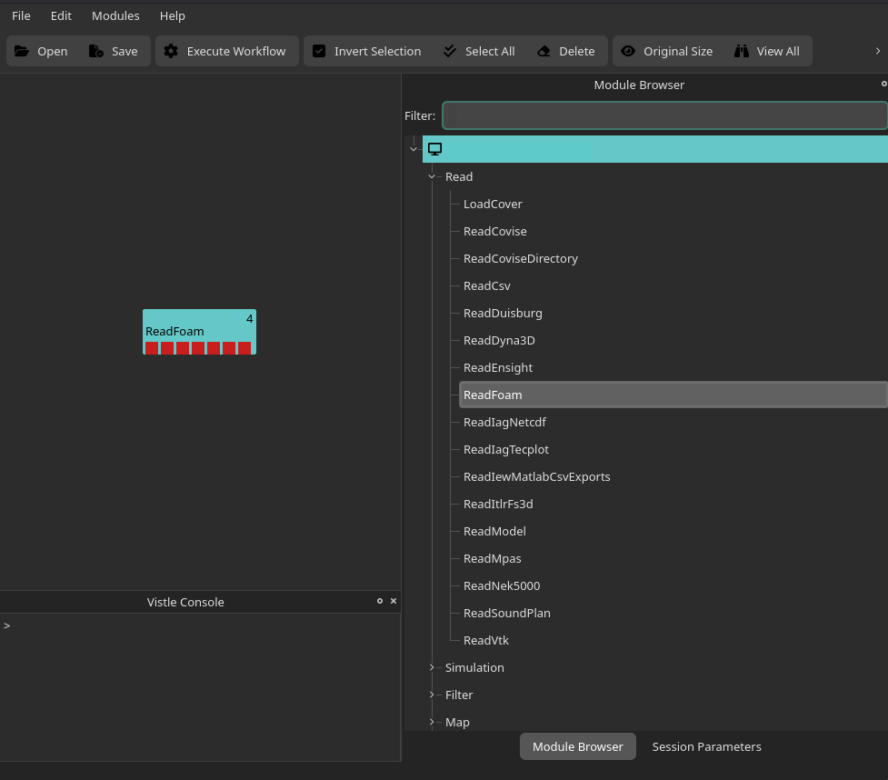

# Example: Visualizing OpenFOAM Simulation Results

<!-- TODO: add Visualizing Grids -->

In this step-by-step tutorial you will learn how to visualize a sample CFD dataset which was simulated using OpenFOAM.

## Overview
- [Getting the Sample Dataset](#getting-the-sample-dataset)
- [Reading in the Simulation Results](#reading-in-the-simulation-results)
- [Visualizing Scalar Data Fields](#visualizing-scalar-data-fields)
- [Visualizing Vector Data Fields](#visualizing-vector-data-fields)
- [Adding 3D Models to the Visualization](#adding-3d-models-to-the-visualization)

## Getting the Sample Dataset

The data for this tutorial will be the motorbike tutorial which comes with OpenFOAM. First, follow the instructions on [OpenFOAM's official website](https://www.openfoam.com/news/main-news/openfoam-v2412) to install the software on your system.

Next, open a terminal and set up the OpenFOAM environment:
```bash
source <OpenFOAM directory>/etc/bashrc
```
Replace `<OpenFOAM directory>` with the folder you installed OpenFOAM to, e.g., `/opt/OpenFOAM/OpenFOAM-v2412`. This sets up all necessary environment variables in your terminal, including `FOAM_TUTORIALS` which hosts the official tutorial simulation cases.

Create a working directory, navigate into it and copy the motorbike data into the new folder:
```bash
mkdir run && cd run
cp -r $FOAM_TUTORIALS/incompressible/simpleFoam/motorBike .
```

Navigate into the `motorBike` folder and run the simulation:

```bash
cd motorBike
./Allrun
```

This generated the simulation results we will start to visualize in Vistle in the next section.
Later on, we will also add the 3D model of the motorcyclist to the visualization, so as a final step, we need to extract `motorBike.obj`:

```bash
cd constant/triSurface
gunzip motorBike.obj.gz 
```
## Reading in the Simulation Results

Now, that we have generated the simulation results using OpenFOAM, we can open Vistle to read them in and create a visualization workflow.

To open Vistle, navigate to Vistle's root directory, i.e., the directory containing the Vistle repository, and execute the following in a terminal:
```bash
vistle
```

You can save the workflow anytime with the `File` &rarr; `Save`  buttons or  by using `CTRL` + `S`.

Locate the `ReadFoam` module in the module browser and drag and drop it into the workflow area on the left:


Note that you can also search for modules by name with `Filter` search bar at the top of the module browser.

Left-click on the `ReadFoam` module to adjust its module parameters:


First, select the case directory containing the simulation data, i.e., the path to the `motorBike` folder we have created in the first section of this guide (see 1 in figure above), by either copying the full path into the text field or by browsing for it with the folder button.
Double-click on the `ReadFoam` module to execute it.

After executing the module once, you will be able to select up to three data fields of interest with the help of the drop-down lists `Data0`, `Data1` and `Data2`. For the sake of this tutorial, we chose the vector field `U`, i.e., the air flow's velocity, as well as the scalar data field `p`, i.e., the pressure (see 2 in figure above). 
The first port of `ReadFoam` now contains the data grid used in the simulation, the second one contains the three-dimensional velocity vector field and the third port the scalar pressure data field.

**Tip:** For large datasets consisting of multiple timesteps, you can select which timesteps should be read in (see 3 in figure above). By default, all timesteps are read in. You can specify the range of timesteps with the `first step` and `last step` parameters and you can also change the `step increment`. To, e.g., read in every 5th time step in the dataset, you would set `step increment` to 5, `first step` to 0 (this is the first time step) and `last step` to -1 (which is the last time step). Reducing the number of time steps is useful to reduce the execution time and RAM requirements for very large datasets, which makes it easier to play around with different visualization modules and module parameters while creating a visualization workflow. Once you are happy with the workflow, you can read in the entire dataset.

## Visualizing Grids
While it is more typical to visualize the data fields mapped onto the grid generated by the simulation, it is, of course, also possible to visualize the grid itself.

One possible visualization workflow for grids is shown in the following figure:


When adding the [](project:#mod-COVER) module (see 1 in figure above) to a visualization workflow, the renderer COVER is, by default, automatically opened on the desktop (see 2 in figure above), although it can also be configured to be run in a VR environment with the `COCONFIG` environment variable.

Since the grid returned by `ReadFoam` is a polygon grid, i.e., a geometry, we can directly connect it to the `COVER` module to visualize it. For other grid types, like uniform or unstructured grids, we would have to place a [](project:#mod-DomainSurface) module before COVER.

The [](project:#mod-BoundingBox) module (see 3 in figure above) can be used to visualize the bounding box of a grid. It also provides information on the grid's extrema (see 4 in figure above).

## Visualizing Scalar Data Fields
In this section we will discuss a typical visualization workflow for scalar data fields, such as the pressure fields in the sample dataset:

<!--  p-Cuttingsurface: show how to change parameters of Cuttingsurface (in Module Browser and in Cover wiht pick interactor, this is easier with a BoundingBox) <-- also show how to add/adjust colormap! -->


Each data field, be it scalar or vector, can be mapped to color with the [](project:#mod-Color) module. When connecting its second port to `COVER`, the desired color map (in this example 'Plasma') will automatically be applied to each rendered object which contains (part of) the scalar field.  

The color map (see 2 in figure below) can be added to the renderer by toggling the `Show` button (see 1 in figure below; `Vistle` &rarr; `Colors` &rarr; `Color_x` (where x is the ID of the `Color` module, this can be seen in the top right corner of the Vistle module) &rarr; `Show`): 


The [](project:#mod-CuttingSurface) module cuts a three-dimensional grid along basic geometries, such as planes, spheres or cylinders. For this example, we cut the grid using a plane. There are two ways to the define the cutting geometry, either by adjusting the module parameters:


Or, interactively in the renderer by using a pick interactor:


The pick interactor (see 2 in figure above) can be enabled by clicking the `Vistle` tab at the top of the renderer, selecting the correct `CuttingSurface_x` entry (x is the ID of the desired `CuttingSurface` module which is displayed at the top right corner of the module rectangle) and setting `Pick Interactor` to true (see 1 in figure above). In a desktop environment, the pick interactor can be moved by dragging the end of the arrow to the desired position and rotated by moving the tip of the arrow.

## Visualizing Vector Data Fields

## Adding 3D Models to the Visualization
<!-- Tracer + Thicken + ToTriangles and all the parameters to make it look nice ':D   -->

