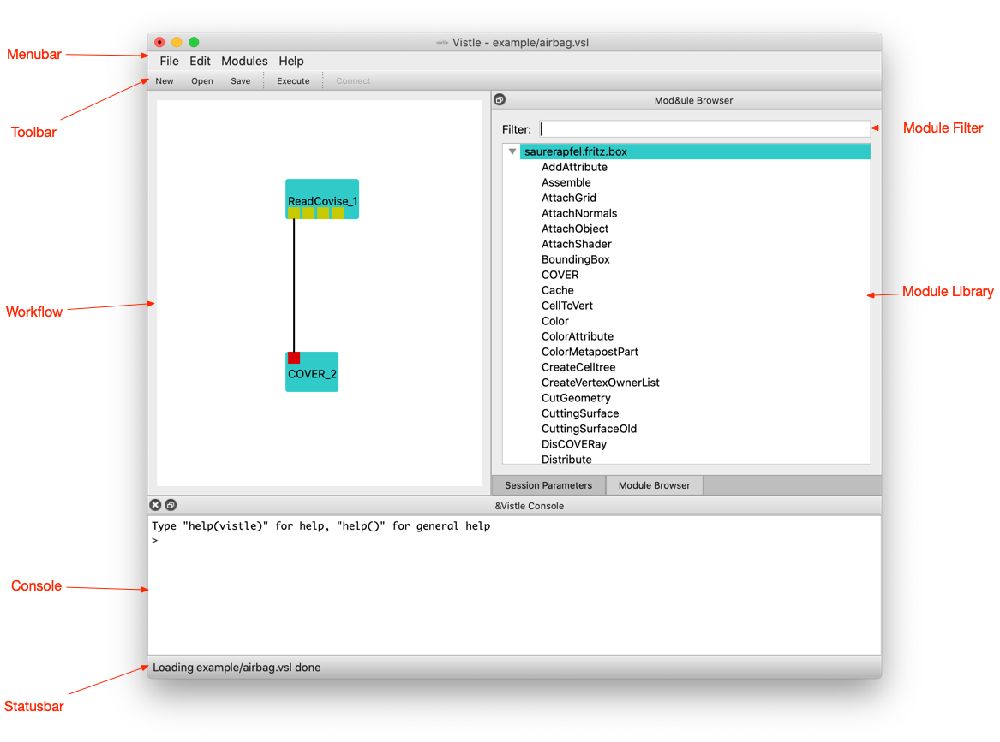

## Graphical User Interface for Loading and Executing Workflows ##

From a running graphical user interface, you can load a preconfigured visualization workflow. You can navigate to the *File* menu and click on the *Open...* entry.

This will bring up a file browser dialog for locating an existing Vistle workflow on your computer. They usually employ the extension `.vsl`, but they are just regular [Python](../../advanced/scripting/scripting.md) scripts. The *Open* shortcut of your operating system should show the same dialog. After choosing a file, a graphical representation of the workflow is shown in the workflow editor. The steps of the workflow are called modules. They can receive data from upstream modules at input ports and provide data to other module at output ports by establishing a connection between these ports. Modules are represented as boxes, their input ports are small squares at the top of the module box, and their outputs are at the bottom. Connections from output to input ports are depicted as lines.

You can execute the workflow by choosing the *Execute* from the *Modules* menu. This is also triggered by the *Reload* shortcut. This starts execution of the workflow by executing all source modules, i.e. modules that have no input connection. Execution of downstream modules with connected inputs is triggered as soon as input arrives at a port. Modules that are still executing are shown with a highlighted border.

Now we start by loading an [existing workflow](vistle:///open#example/airbag.vsl): type `vistle example/airbag.vsl` into your command interpreter, while the root directory of the Vistle source code repository is the current directory. A new Vistle session will be started and the graphical user interface will appear, showing a simple workflow, as seen in the following figure.

At the top of the window, there is a menu bar and a toolbar for shortcuts to often used menu items, at the bottom a status bar, which will occasionally display progress information. The left area of the window is the workflow area, where the visualization pipeline is displayed graphically. At the right of the window, there is the module library, which contains all the available visualization modules. The bottom pane is the Vistle console, where you can enter Python commands and where modules can display messages.

Modules encapsulate processing steps of the workflow. They are shown as turquoise boxes. The output that they produce is sent to output ports, which can be connected to input ports of other modules. Output ports are shown as yellow squares at the bottom of the module box, input ports as red squares at the top. Connections between ports are depicted as lines. The workflow in this example includes two modules, [ReadCovise](project:#mod-ReadCovise) for reading in the data, and the renderer [COVER](project:#mod-COVER) for displaying the data. The first output port of the reader is connected to the renderer input. As the renderer is a separate application, it will open an additional window. The [next section](../render/cover.md) will describe how to use it.
