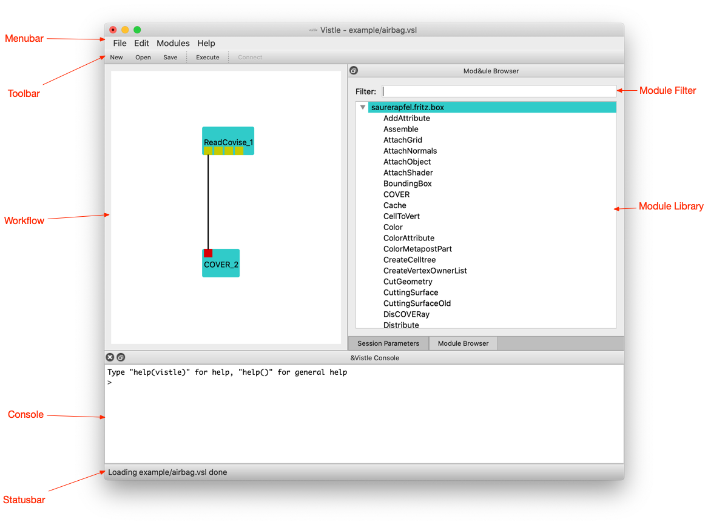

## Graphical User Interface for Loading and Executing Workflows ##

From a running graphical user interface, you can load a preconfigured visualization workflow. You can navigate to the *File* menu and click on the *Open...* entry.

This will bring up a file browser dialog for locating an existing Vistle workflow on your computer. They usually employ the extension `.vsl`, but they are just regular [Python](../../advanced/scripting/scripting.md) scripts. The *Open* shortcut of your operating system should show the same dialog. After choosing a file, a graphical representation of the workflow is shown in the workflow editor. The steps of the workflow are called modules. They can receive data from upstream modules at input ports and provide data to other module at output ports by establishing a connection between these ports. Modules are represented as boxes, their input ports are small squares at the top of the module box, and their outputs are at the bottom. Connections from output to input ports are depicted as lines.

You can execute the workflow by choosing the *Execute* from the *Modules* menu. This is also triggered by the *Reload* shortcut. This starts execution of the workflow by executing all source modules, i.e. modules that have no input connection. Execution of downstream modules with connected inputs is triggered as soon as input arrives at a port. Modules that are still executing are shown with a highlighted border.

Now we start by loading an existing workflow: type `vistle example/airbag.vsl` into your command interpreter, while the root directory of the Vistle source code repository is the current directory. A new Vistle session will be started and the graphical user interface will appear, showing a simple workflow, as seen in figure 1.

At the top of the window, there is a menubar and a toolbar for shortcuts to often used menu items, at the bottom a statusbar, which will occasionally display progress information. The left area of the window is the workflow area, where the visualization pipeline is displayed graphically. At the right of the window, there is the module library, which contains all the available visualization modules. The bottom pane is the Vistle console, where you can enter Python commands and where modules can display messages.

Modules encapsulate processing steps of the workflow. They are shown as turquoise boxes. The output that they produce is sent to output ports, which can be connected to input ports of other modules. Output ports are shown as yellow squares at the bottom of the module box, input ports as red squares at the top. Connections between ports are depicted as lines. The workflow in this example includes two modules, *ReadCovise* for reading in the data, and the renderer *COVER* for displaying the data. The first output port of the reader is connected to the renderer input. As the renderer is a separate application, it will open an additional window. The next section will describe how to use it.

## Creating and Modifying Workflows ##

This section will show you how to create your own visualization workflows. When Vistle starts, you are presented with an empty workflow. Whenever you need to start over, you can do so by invoking *New* from the *File* menu.

### Adding Modules to a Workflow ###

Modules can be added to the workflow by dragging a template from the module library to the workflow area. The library becomes visible when no module is selected in the workflow area. Modules can be found quickly by "filtering" the library according to the string entered in the text input field at the top of the library.

### Connecting Modules ###

Modules need to be connected in order to be useful. You can establish links from output ports to input ports of other modules by "dragging" the mouse from the source port to the destination port, i.e. by pressing the mouse button on the source port and while still pressing on it moving to the destination, where you release the mouse button.

A connection is represented as a line. A double click on this line will remove that connection.

Connection only work between compatible ports, i.e. the kind of data produced by the source has to be understood by the destination module at the connected input port. Currently, there is no mechanism to check this when establishing the link. Only when executing the workflow, the receiving module should notify you of incompatible input data.

### Module Parameters ###

The parameters of a module in the workflow can be modified after selecting it in the workflow area: the parameter dialog for this module will be shown instead of the module library.

### Session Parameters ###

### Saving a Workflow ###

The current workflow can be saved by using the *Save* or *Save As...* entries from the *File* menu. This means that all modules in the workflow together with their parameter values and connections will be stored as a [Python](../../advanced/scripting/scripting.md) script with the extension `.vsl`, so that the workflow can be loaded and executed again later.

## Attaching a User Interface to a Running Vistle Session ##

A graphical user interface for controlling a Vistle session can be launched via `vistle_gui`. Without any additional parameters it tries to connect to the default port (31093) on `localhost`. Another host and port can be specified as additional parameters. So, in order to connect to `visent.hlrs.de` on port 31095, one would enter the following command:

	vistle_gui visent.hlrs.de 31095
