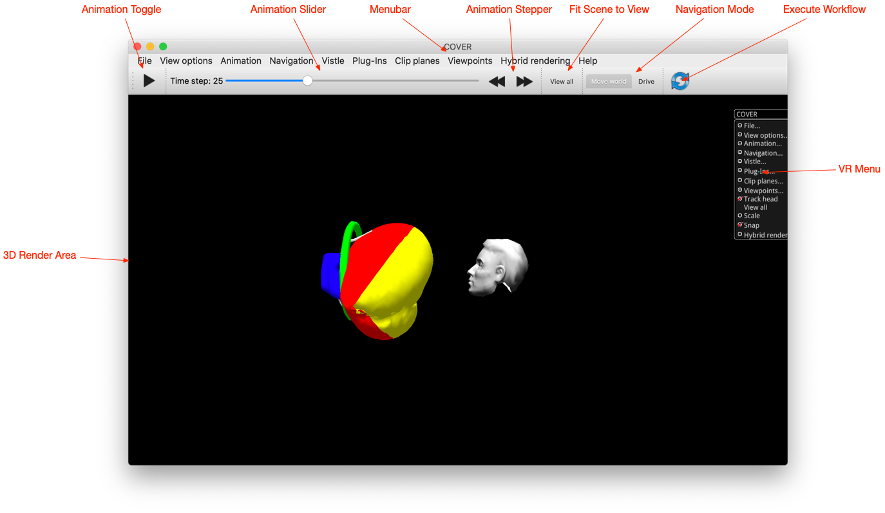

## The COVER Renderer

[COVER](project:#mod-COVER) is the module responsible for displaying the 3D scene. You can use it on a desktop, but it works as well an immersive multi-screen projection system and with VR glasses. Here, we learn how to use it when configured for the desktop. Although it can be used independent from a visualization system (i.e. COVISE or Vistle), we will only look at how to use it with Vistle.

The COVER window consists of a menu bar at the top, a Toolbar below and the render area, where
the scene is shown. You can interact with the scene using your mouse. Moreover, there is the VR
Menu, usually at the right-hand side of the render area. From there, as well as from the menu and
Toolbar, you can configure several often used settings. In the figure above, which shows the COVER window,
the Toolbar buttons functions are indicated by labels. From left to right you can find settings for
animations, views, navigation, and workflow execution.

The 3D render area shows the visualization scene. Clicking into it allows navigation within the scene. It also shows a 3D floating menu, which is mainly used for interaction from immersive virtual environments. But as not all functionality is exposed from the desktop menu, you might need to resort to it.

When an entry in the VR Menu is selected, a frame for its content opens up. Click the Menu entry
once more to hide the frame again.

If COVER is started from within Vistle, a Vistle menu item is available in the menu bar. From there it is
possible to manipulate [Module Parameters](../gui/use.md#module-parameters) and enable interactors.
These interactors allow you to manipulate the parameters of workflow modules using the mouse.
For example, you can modify the plane position of a [CuttingSurface](project:#mod-CuttingSurface) module slicing through the data by dragging the position manipulator.

Further, COVER comes along with a tablet user interface (*TabletUI*), which allows the user to adjust
many other parameters and in many cases offers more detailed settings. The *TabletUI* attaches to a
running COVER and can be started using the command:

    tabletUI

You can also start COVER without Vistle, by typing:

    opencover
