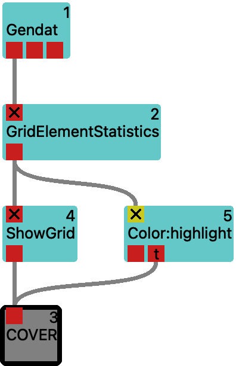

(mod-GridElementStatistics)=

# GridElementStatistics
show characteristics of selected unstructured grid element

## Purpose

Prints stats of a single element in an unstructured grid:
type, dimensionality, edge length, surface, volume
Outputs data on the grid where only the selected element is higlighted.

<svg width="131.8em" height="6.6em" >

<rect x="0em" y="1.8em" width="13.18em" height="3.0em" rx="0.1em" ry="0.1em" style="fill:#64c8c8ff;" />
<rect x="0.2em" y="1.8em" width="1.0em" height="1.0em" rx="0.0em" ry="0.0em" style="fill:#c81e1eff;" >
<title>grid_in</title></rect>
<rect x="0.7em" y="0.8em" width="0.03333333333333333em" height="1.0em" rx="0.0em" ry="0.0em" style="fill:#000000;" />
<rect x="0.7em" y="0.8em" width="1.0em" height="0.03333333333333333em" rx="0.0em" ry="0.0em" style="fill:#000000;" />
<text x="1.9em" y="0.9em" class="text" >unstructured grid with or without data<tspan> (grid_in)</tspan></text>
<text x="0.2em" y="3.6500000000000004em" class="moduleName" >GridElementStatistics</text><rect x="0.2em" y="3.8em" width="1.0em" height="1.0em" rx="0.0em" ry="0.0em" style="fill:#c81e1eff;" >
<title>data_out</title></rect>
<rect x="0.7em" y="4.8em" width="0.03333333333333333em" height="1.0em" rx="0.0em" ry="0.0em" style="fill:#000000;" />
<rect x="0.7em" y="5.8em" width="1.0em" height="0.03333333333333333em" rx="0.0em" ry="0.0em" style="fill:#000000;" />
<text x="1.9em" y="5.8999999999999995em" class="text" >unstructured grid with highlighted element<tspan> (data_out)</tspan></text>
</svg>

## Parameters

|name|description|type|
|-|-|-|
|element_index|index of the element to inspect|Int|

:::{admonition} Supported System Parameters
    :class: dropdown

|name|description|type|
|-|-|-|
|[_openmp_threads](../../system-parameters.md#_openmp_threads)|number of OpenMP threads (0: system default)|Int|
|[_benchmark](../../system-parameters.md#_benchmark)|show timing information|Int|
|[_concurrency](../../system-parameters.md#_concurrency)|number of tasks to keep in flight per MPI rank (-1: #cores/2)|Int|
|[_cache_mode](../../system-parameters.md#_cache_mode)|input object caching (CacheNone, CacheDeleteEarly, CacheDeleteLate, CacheByName)|Int|
|[_prioritize_visible](../../system-parameters.md#_prioritize_visible)|prioritize currently visible timestep|Int|
|[_validate_objects](../../system-parameters.md#_validate_objects)|validate data objects before sending to port (Disable, Quick, Thorough)|Int|

The meaning of these parameters is described in more detail in the [System Parameters](../../system-parameters.md) documentation.
:::

## Usage Examples

<figure float="left">
    
    
    <figcaption>Fig.1 <a href="vistle:///open#module/develop/GridElementStatistics/GridElementStatistics">GridElementStatistics</a> workflow (left) and expected result (right).</figcaption>
</figure>