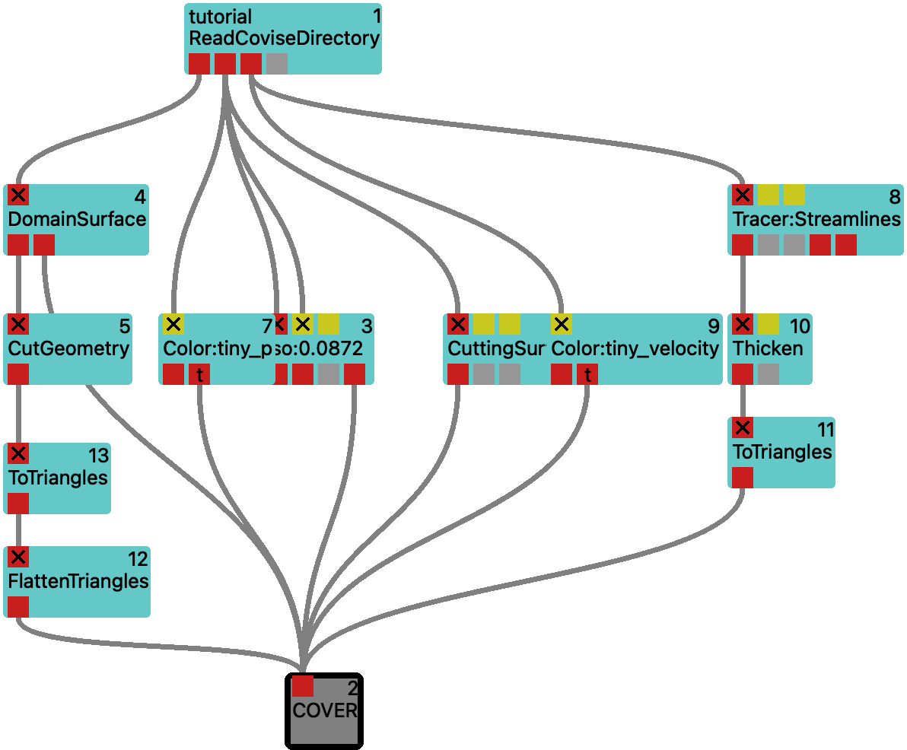
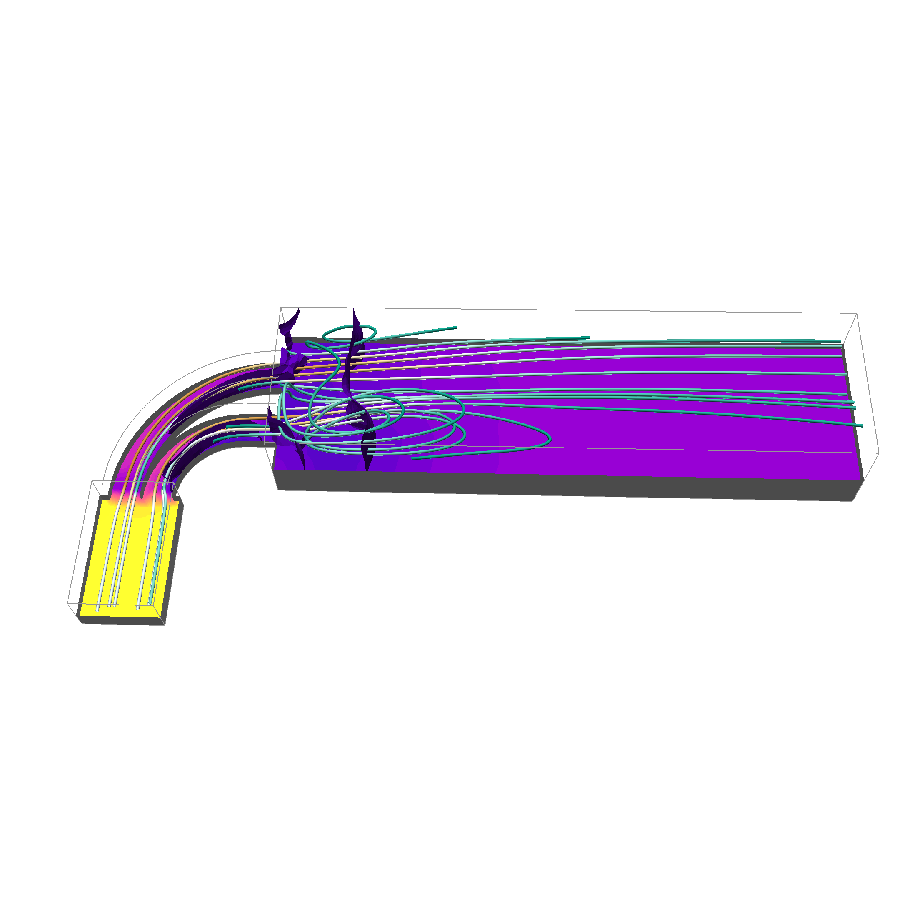

(mod-BoundingBox)=

# BoundingBox
compute axis-aligned bounding boxes

## Purpose

The bounding box can be used as a rough guide to the interesting areas of the data set. The box can
also provide visual clues that help with orientation in 3D space. Showing bounding boxes for
individual blocks will allow you to assess the partitioning of your data. The numerical values can
be used to craft input for modules requiring coordinates as parameter input.

## Ports

<svg width="73.8em" height="7.6em" >

<rect x="0em" y="1.8em" width="7.38em" height="3.0em" rx="0.1em" ry="0.1em" style="fill:#64c8c8ff;" />
<rect x="0.2em" y="1.8em" width="1.0em" height="1.0em" rx="0.0em" ry="0.0em" style="fill:#c81e1eff;" >
<title>grid_in</title></rect>
<rect x="0.7em" y="0.8em" width="0.03333333333333333em" height="1.0em" rx="0.0em" ry="0.0em" style="fill:#000000;" />
<rect x="0.7em" y="0.8em" width="1.0em" height="0.03333333333333333em" rx="0.0em" ry="0.0em" style="fill:#000000;" />
<text x="1.9em" y="0.9em" class="text" >input data<tspan> (grid_in)</tspan></text>
<text x="0.2em" y="3.6500000000000004em" class="moduleName" >BoundingBox</text><rect x="0.2em" y="3.8em" width="1.0em" height="1.0em" rx="0.0em" ry="0.0em" style="fill:#c81e1eff;" >
<title>grid_out</title></rect>
<rect x="0.7em" y="4.8em" width="0.03333333333333333em" height="2.0em" rx="0.0em" ry="0.0em" style="fill:#000000;" />
<rect x="0.7em" y="6.8em" width="1.0em" height="0.03333333333333333em" rx="0.0em" ry="0.0em" style="fill:#000000;" />
<text x="1.9em" y="6.8999999999999995em" class="text" >bounding box<tspan> (grid_out)</tspan></text>
<rect x="1.4em" y="3.8em" width="1.0em" height="1.0em" rx="0.0em" ry="0.0em" style="fill:#c81e1eff;" >
<title>transform_out</title></rect>
<rect x="1.9em" y="4.8em" width="0.03333333333333333em" height="1.0em" rx="0.0em" ry="0.0em" style="fill:#000000;" />
<rect x="1.9em" y="5.8em" width="1.0em" height="0.03333333333333333em" rx="0.0em" ry="0.0em" style="fill:#000000;" />
<text x="3.0999999999999996em" y="5.8999999999999995em" class="text" >empty data object carrying transformation<tspan> (transform_out)</tspan></text>
</svg>

The BoundingBox module takes its geometry input from `grid_in` and finds global minimum and maximum
values for its coordinates. The result of this process can be seen in its parameter window as the
values of the `min` and `max` parameters. The location of the extremal values are recorded in its
other output parameters. It also provides a tight axis-aligned cuboid around the domain of the data
at the `grid_out` output.

## Parameters

|name|description|type|
|-|-|-|
|per_block|create bounding box for each block individually|Int|
|per_timestep|create bounding box for each timestep individually|Int|
|transformation_name|tag for derived transformation|String|
|min|output parameter: minimum|Vector|
|max|output parameter: maximum|Vector|
|min_block|output parameter: block numbers containing minimum (per component)|IntVector|
|max_block|output parameter: block numbers containing maximum (per component)|IntVector|
|min_index|output parameter: indices of minimum (per component)|IntVector|
|max_index|output parameter: indices of maximum (per component)|IntVector|

:::{admonition} Supported System Parameters
    :class: dropdown

|name|description|type|
|-|-|-|
|[_openmp_threads](../../system-parameters.md#_openmp_threads)|number of OpenMP threads (0: system default)|Int|
|[_benchmark](../../system-parameters.md#_benchmark)|show timing information|Int|
|[_concurrency](../../system-parameters.md#_concurrency)|number of tasks to keep in flight per MPI rank (-1: #cores/2)|Int|
|[_cache_mode](../../system-parameters.md#_cache_mode)|input object caching (CacheNone, CacheDeleteEarly, CacheDeleteLate, CacheByName)|Int|
|[_prioritize_visible](../../system-parameters.md#_prioritize_visible)|prioritize currently visible timestep|Int|
|[_validate_objects](../../system-parameters.md#_validate_objects)|validate data objects before sending to port (Disable, Quick, Thorough)|Int|

The meaning of these parameters is described in more detail in the [System Parameters](../../system-parameters.md) documentation.
:::

By enabling `per_block`, it creates an enclosing cuboid for each input
block individually instead of for all blocks globally.

## Usage Examples

<figure float="left">
    
    
    <figcaption>Fig.1 <a href="vistle:///open#module/map/BoundingBox/tiny-covise">tiny-covise</a> workflow (left) and expected result (right).</figcaption>
</figure>

## Related Modules

### Similar Modules

